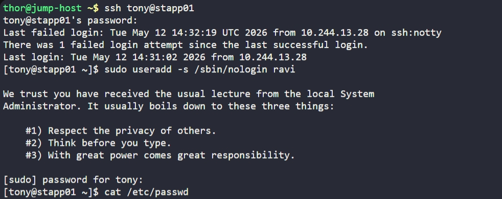

# Day 1: Linux User Setup with Non-Interactive Shell

## Objective

Create a user named `ravi` with a non-interactive shell on App Server 1.

## Concept: Non-Interactive / Non-Login Shell

A non-interactive (non-login) shell means the user:

- Cannot log in via SSH or terminal
- Cannot get a command prompt session
- Exists as a system/service account
- Can still be used by services or automation tools

It is commonly used for system accounts like: MySQL creates mysql user, PostgreSQL creates postgres user and Nginx runs as www-data.

These users exist for applications, not humans.

## Steps Performed

### 1. SSH into App Server 1

```bash
ssh tony@stapp01
```

### 2. Create user with non-interactive shell

```bash
sudo useradd -s /sbin/nologin ravi
```

- `-s` flag sets the login shell for the user.
- `/sbin/nologin` a special fake shell that doesn't give a terminal and if someone tries to SSH/Login with this user, the access is blocked.

## Verification

Check user entry:

```bash
cut -d: -f1 /etc/passwd
```

Or inspect full entry:

```bash
cat /etc/passwd | grep ravi
```

Expected shell field:

```
/sbin/nologin
```

## Screenshot

