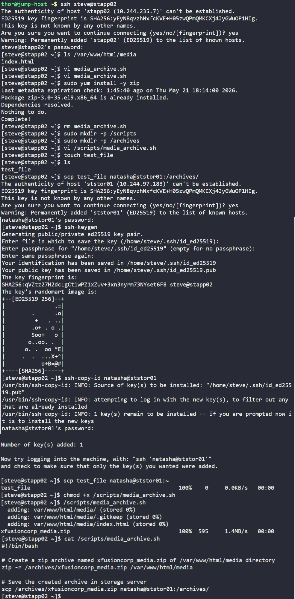

# Day 10: Linux Bash Scripts

Create a bash automation script on **App Server 2** that automates archiving the website media files and moving them to long-term storage.

The script `media_archive.sh` in `/scripts` must:

- compress `/var/www/html/media` in App server 2 into a zip file named `xfusioncorp_media.zip`
- store the archive locally in `/archives` on **App Server 2** (temporary storage)
- copy the archive to the Nautilus `Storage Server` in **/archives**
- executes without asking for a password when transferring files
- be runnable by the normal server user
- not use sudo inside the script
- require `zip` to be installed manually before running the script on the App server 2

## 1. Connected to App Server 2
```bash
ssh steve@stapp02
```

## 2. Verified Website Media Directory
```bash
ls /var/www/html/media
```
Result
```bash
index.html
```
Just to confirm that the media directory exists and contains website files to archive

## 3. Installed Required zip Package
```bash
sudo yum install -y zip
```

## 4. Created Required Directories
```bash
sudo mkdir -p /scripts
sudo mkdir -p /archives
```

- `/scripts`: to store the automation scripts as required by the task
- `/archives`: temporary local archive storage

## 5. Created Automation Script

```bash
#!/bin/bash

# Create a zip archive named xfusioncorp_media.zip of /var/www/html/media directory
zip -r /archives/xfusioncorp_media.zip /var/www/html/media

# Save the created archive in storage sever
scp /archives/xfusioncorp_media.zip natasha@ststor01:/archives/
```

- `zip`: creates compressed archive
- `-r`: recursive (include all files/subdirectories)
- `/archives/xfusioncorp_media.zip`: output archive file
- `/var/www/html/media`: source directory

Archive Transfer
- `scp` secure copy over SSH
- transfers archive to Nautilus Storage Server
- destination: `natasha@ststor01:/archives/`

## 7. Configured Passwordless SCP

Initially, SCP requested a password:
```bash
natasha@ststor01's password:
```
This indicated SSH key authentication was not configured

Generated SSH Key Pair
```bash
ssh-keygen
```

Copied Public Key to Storage Server
```bash
ssh-copy-id natasha@ststor01
```

This added the public key to: `~/.ssh/authorized_keys` on the storage server.

Verified Passwordless SCP
```bash
scp test_file natasha@ststor01:~
```
And the file was transferred successfully without password prompt, confirming that passwordless SSH/SCP authentication was working correctly

## 8. Made Script Executable
```bash
chmod +x /scripts/media_archive.sh
```

## Screenshot

