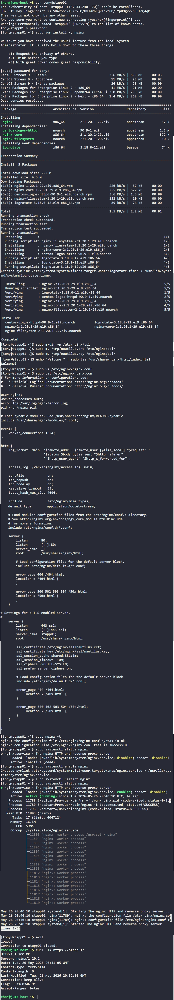

# Day 15: Setup SSL for Nginx

## Objective
Prepare App Server 1 (`stapp01`) for a new application deployment by installing Nginx, configuring a self-signed SSL certificate for secure HTTPS access, and setting up the initial web content.


## 1. Installed Nginx

```bash
ssh tony@stapp01
sudo yum install -y nginx
```


## 2. Configured SSL Certificates
Standard security practice dictates that SSL certificates should be stored in a dedicated, secure directory within the Nginx configuration path.

```bash
# Create the secure directory
sudo mkdir -p /etc/nginx/ssl

# Move the certificate and key from /tmp
sudo mv /tmp/nautilus.crt /etc/nginx/ssl/
sudo mv /tmp/nautilus.key /etc/nginx/ssl/
```


## 3. Modified Nginx Configuration
We edited the main configuration file to enable a TLS-enabled server block listening on port **443**.

```bash
sudo vi /etc/nginx/nginx.conf
```

**Key changes made in the `server` block:**
- Set `listen 443 ssl;`
- Defined the server name: `server_name stapp01;`
- Linked the certificates:
  ```nginx
  ssl_certificate /etc/nginx/ssl/nautilus.crt;
  ssl_certificate_key /etc/nginx/ssl/nautilus.key;
  ```
- Verified the root directory: `root /usr/share/nginx/html;`

Before restarting, we validated the configuration syntax:
```bash
sudo nginx -t
```


## 4. Created Web Content
We created the required `index.html` file in the Nginx document root to test.

```bash
echo "Welcome!" | sudo tee /usr/share/nginx/html/index.html
```


## 5. Started and Enabled the Service

```bash
sudo systemctl enable nginx
sudo systemctl restart nginx
```


## 6. Final Verification
From the **Jump Host**, we used `curl` to verify the HTTPS connection. We used the `-k` flag to allow the self-signed certificate and `-I` to view the headers.

```bash
curl -Ik https://stapp01/
```

### Result
The server successfully responded with a **200 OK** status over HTTPS:
```text
HTTP/1.1 200 OK
Server: nginx/1.20.1
Date: Tue, 26 May 2026 20:41:05 GMT
Content-Type: text/html
...
```

The server is now hardened with SSL and ready for application deployment.


## Screenshot

