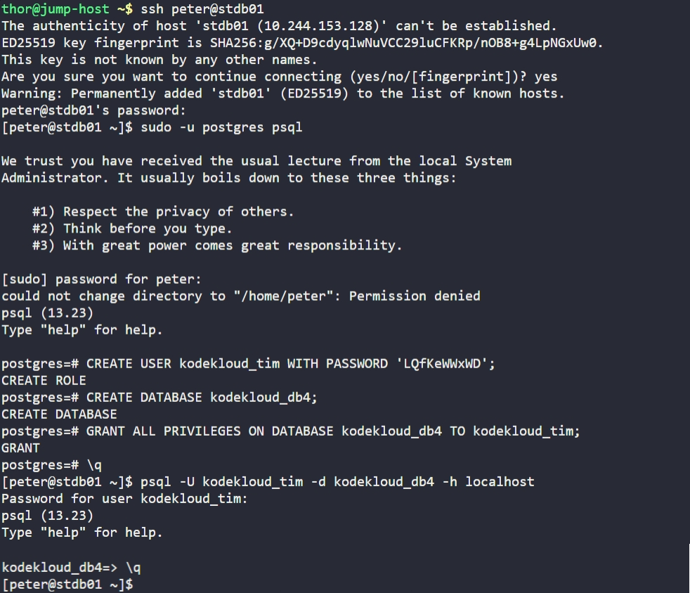

# Day 17: Install and Configure PostgreSQL

## Objective

Configure the PostgreSQL database server on `stdb01` to support a new application deployment. This involves creating a dedicated database `kodekloud_db4`, a specific application user `kodekloud_tim` with secure credentials `LQfKeWWxWD`, and granting the necessary privileges for the application to function.


## 1. Connected to Database Server
```bash
ssh peter@stdb01
```


## 2. Accessed PostgreSQL Administrative Console
Since the PostgreSQL service was already running, we accessed the administrative shell using the `postgres` system user. This allowed us to perform administrative tasks without restarting the service.

```bash
sudo -u postgres psql
```


## 3. Created User and Database
```sql
-- Create the application user with the specified password
CREATE USER kodekloud_tim WITH PASSWORD 'LQfKeWWxWD';

-- Create the application database
CREATE DATABASE kodekloud_db4;

-- Grant the user full control over the new database
GRANT ALL PRIVILEGES ON DATABASE kodekloud_db4 TO kodekloud_tim;
```


## 4. Verified the Configuration
To ensure the setup was successful and the permissions were correctly applied, we attempted to log in directly as the new user to the new database.

```bash
psql -U kodekloud_tim -d kodekloud_db4 -h localhost
```

### Result
The login was successful, and we were dropped into the `kodekloud_db4` prompt:
```text
Password for user kodekloud_tim: 
psql (13.23)
Type "help" for help.
kodekloud_db4=>
```

## Screenshot
