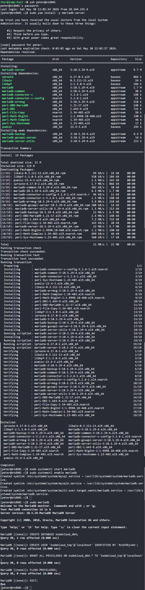

# Day 18: Install and Configure DB Server

## Objective
Set up a MariaDB database server on the Nautilus database server (`stdb01`) to support a new application. The task involves installing the service, ensuring it is persistent, creating a specific database, and provisioning a dedicated user with full administrative privileges on that database.


## 1. Connected to Database Server and Installed MariaDB
```bash
ssh peter@stdb01
sudo yum install -y mariadb-server
```

## 2. Started and Enabled MariaDB Service
```bash
sudo systemctl start mariadb
sudo systemctl enable mariadb
```


## 3. Configured Database and User Privileges
```bash
sudo mariadb
```

Inside the MariaDB console, we ran the following commands:

```sql
-- Create the application database
CREATE DATABASE kodekloud_db4;

-- Create the application user for local access with secure credentials
CREATE USER 'kodekloud_top'@'localhost' IDENTIFIED BY 'Rc5C9EyvbU';

-- Grant full permissions to the user specifically for the new database
GRANT ALL PRIVILEGES ON kodekloud_db4.* TO 'kodekloud_top'@'localhost';

-- Refresh the grant tables to apply changes immediately
FLUSH PRIVILEGES;

EXIT;
```


## 4. Verification
The successful execution of the queries confirmed that the schema and user are ready. The database environment is now fully prepared for the application deployment on the Nautilus infrastructure.


## Screenshot
