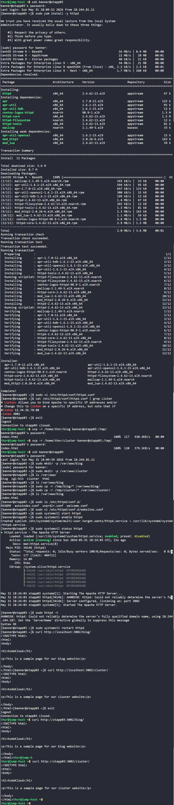

# Day 19: Install and Configure Web Application

## Objective
Deploy and host two separate static websites (**blog** and **cluster**) on App Server 3 (`stapp03`) within the Stratos Datacenter. The setup requires Apache to serve content on a custom port (**3002**) and handle sub-directory routing for both application backups.

## 1. Installed Apache (`httpd`)

```bash
ssh banner@stapp03
sudo yum install -y httpd
```

## 2. Configured Custom Port
By default, Apache listens on port 80. We modified the main configuration file to comply with the requirement for port **3002**.

```bash
sudo vi /etc/httpd/conf/httpd.conf
```
**Change applied:**
From `Listen 80` to `Listen 3002`.

## 3. Deployed Website Backups
The website files were stored on the jump host. We transferred them to the app server and placed them in specific directories under `/var/www/`.

**From Jump Host:**
```bash
scp -r /home/thor/blog banner@stapp03:/tmp/
scp -r /home/thor/cluster banner@stapp03:/tmp/
```

**On App Server 3:**
```bash
sudo mkdir -p /var/www/blog /var/www/cluster
sudo cp -r /tmp/blog/. /var/www/blog/
sudo cp -r /tmp/cluster/. /var/www/cluster/
```

## 4. Configured Virtual Path Mapping (`Alias`)
To serve two different websites from the same port without using separate VirtualHosts, we created a custom configuration file using `Alias` directives. This maps the URL path to the physical directory on the disk.

```bash
sudo vi /etc/httpd/conf.d/websites.conf
```

**Contents of `websites.conf`:**
```apache
Alias /blog "/var/www/blog"
Alias /cluster "/var/www/cluster"

<Directory "/var/www/blog">
    Require all granted
</Directory>

<Directory "/var/www/cluster">
    Require all granted
</Directory>
```

## 5. Started and Enabled Service
We validated the configuration for syntax errors before starting the service and ensuring it persists after a reboot.

```bash
sudo httpd -t
sudo systemctl start httpd
sudo systemctl enable httpd
```

## 6. Verification
We verified the deployment using `curl` locally on the app server and remotely from the jump host.

**Local Test:**
```bash
curl http://localhost:3002/blog/
curl http://localhost:3002/cluster/
```

**Jump Host Test:**
```bash
curl http://stapp03:3002/blog/
curl http://stapp03:3002/cluster/
```

### Result
Both websites successfully returned their respective HTML content:
*   **Blog:** `<h1>kodekloud</h1> <p>This is a sample page for our blog website</p>`
*   **Cluster:** `<h1>kodekloud</h1> <p>This is a sample page for our cluster website</p>`


## Screenshot
