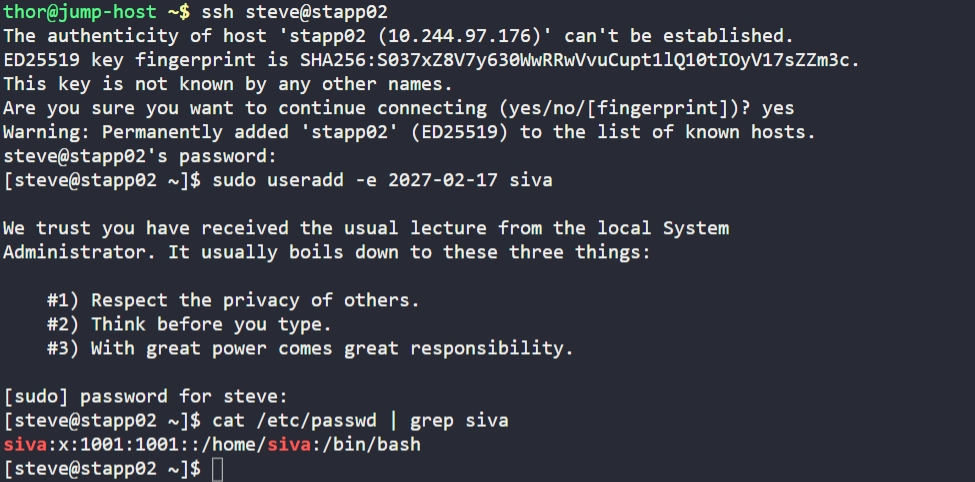

# Day 2: Temporary User Setup with Expiry

## Objective

Create a user named siva on the App Server 2 with an expiry date.

## Steps Performed

### 1. SSH into App Server 2

```bash
ssh steve@stapp02
```

### 2. Create user with an expiration date

```bash
sudo useradd -e 2027-02-17 siva
```

## Verification

```bash
cat /etc/passwd | grep siva
```

## Screenshot

