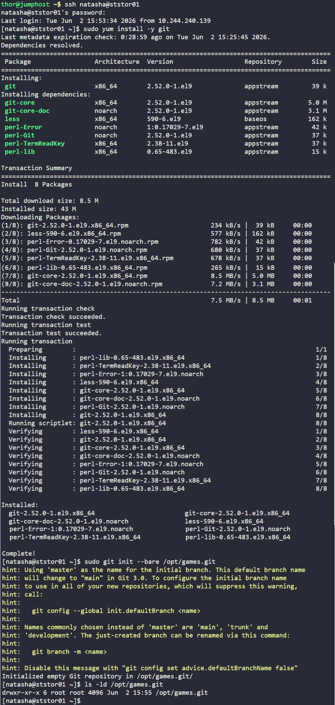

# Day 21: Set Up Git Repository on Storage Server

## Objective
Install Git on the Storage Server (`ststor01`) and initialize a bare repository to serve as a central code storage hub for the development team.

## 1. Install Git

```bash
ssh natasha@ststor01
sudo yum install -y git
```

## 2. Initialize Bare Repository
Created the required bare repository at the specified path. Using the `--bare` flag ensures the repository acts as a server-side hub that can safely accept `git push` commands.

```bash
sudo git init --bare /opt/games.git
```

## 3. Verification
Verified that the repository directory was successfully created.

```bash
ls -ld /opt/games.git
```

## Screenshot
