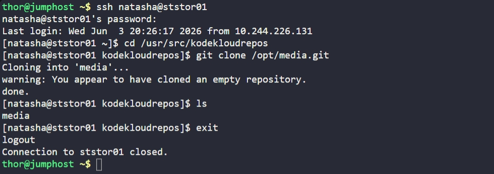

# Day 22: Clone Git Repository on Storage Server

## Objective
Clone an existing central Git repository (`/opt/media.git`) into a specific development directory (`/usr/src/kodekloudrepos`) on the Storage Server (`ststor01`) using the `natasha` user.

## 1. Access the Storage Server

```bash
ssh natasha@ststor01
```

## 2. Navigate to the Target Directory

```bash
cd /usr/src/kodekloudrepos
```

## 3. Clone the Repository

```bash
git clone /opt/media.git
```

## 4. Verification
Confirmed that the `media` directory was successfully created within the target path.

```bash
ls
```

**Result:**
The repository was successfully cloned to `/usr/src/kodekloudrepos/media`, making it ready for the application development team to begin their work.

## Screenshot
