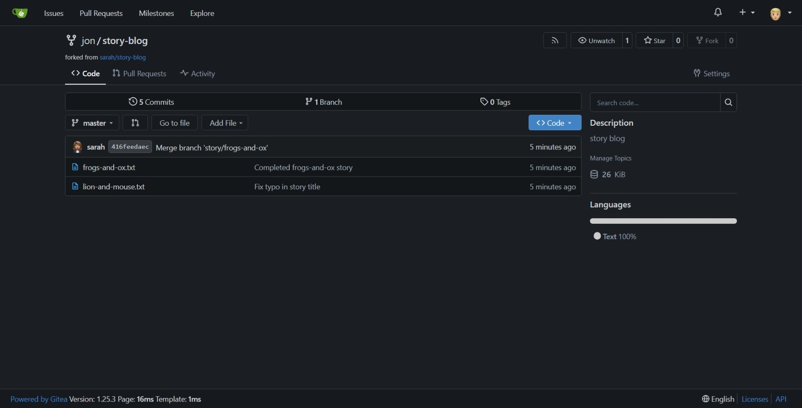

# Day 23: Fork a Git Repository

## Objective
Fork the `sarah/story-blog` repository to the new `jon` user account within the Nautilus Gitea server.

## 1. Login to Gitea
Accessed the Gitea Web UI and authenticated using the following credentials:
- **Username:** `jon`
- **Password:** `Jon_pass123`

## 2. Fork Repository
- Navigated to the repository: `sarah/story-blog`.
- Clicked the **Fork** button located at the top right of the page.
- Confirmed the fork to create a copy under the `jon` namespace.

## 3. Verification
Confirmed the repository was successfully forked. The project is now accessible at the URL: `jon/story-blog`.

## Screenshots
