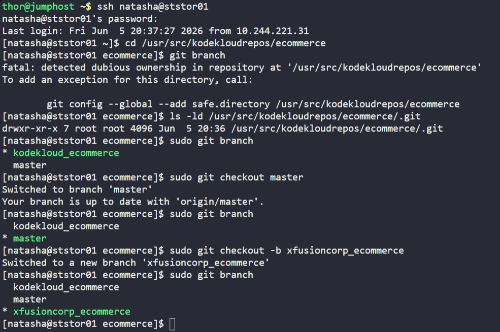

# Day 24: Git Create Branches

## Objective
Create a new branch named `xfusioncorp_ecommerce` from the `master` branch in the `/usr/src/kodekloudrepos/ecommerce` repository on the Storage Server.

## 1. Access the Repository

```bash
ssh natasha@ststor01
cd /usr/src/kodekloudrepos/ecommerce
```

## 2. Manage Permissions and Create Branch
Since the repository is owned by `root`, Git triggered a "dubious ownership" warning. To maintain the original file permissions and satisfy security requirements, all commands were executed with `sudo`.

```bash
# Switch to the master branch
sudo git checkout master

# Create and switch to the new feature branch
sudo git checkout -b xfusioncorp_ecommerce
```

## 3. Verification
Confirmed the new branch was successfully created and is now the active branch.

```bash
sudo git branch
```

## Screenshot
