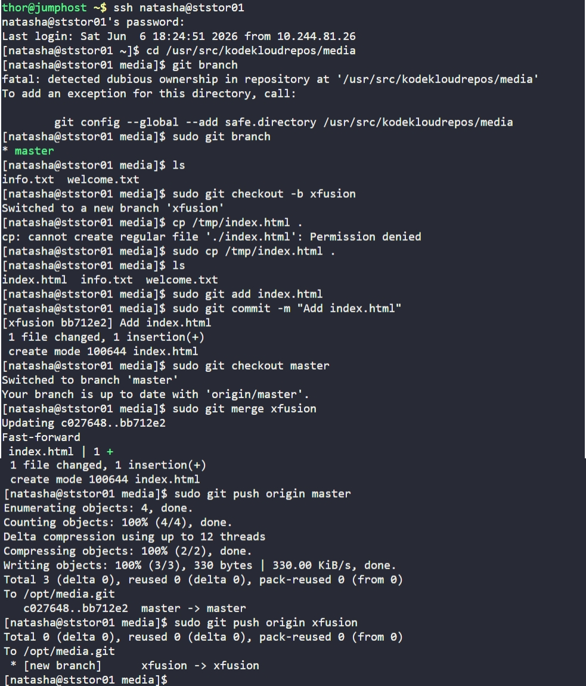

# Day 25: Git Merge Branches

## Objective
Create a new feature branch `xfusion`, add a specific file, merge the changes back into `master`, and push both branches to the central repository (`origin`) on the Storage Server.

## 1. Branch Creation and File Management
Logged into the Storage Server and navigated to the repository. All commands were run with `sudo` to maintain existing `root` ownership and satisfy security requirements.

```bash
cd /usr/src/kodekloudrepos/media

# Create and switch to the 'xfusion' branch
sudo git checkout -b xfusion

# Copy the file from /tmp to the repository
sudo cp /tmp/index.html .

# Add and commit the new file
sudo git add index.html
sudo git commit -m "Add index.html"
```

## 2. Merging and Persistence
Switched back to the `master` branch to integrate the changes from the feature branch.

```bash
# Switch to master
sudo git checkout master

# Merge the 'xfusion' branch into master
sudo git merge xfusion
```

## 3. Pushing to Origin
Pushed the updated `master` branch and the new `xfusion` branch to the central bare repository (`/opt/media.git`).

```bash
sudo git push origin master
sudo git push origin xfusion
```

## Screenshot
