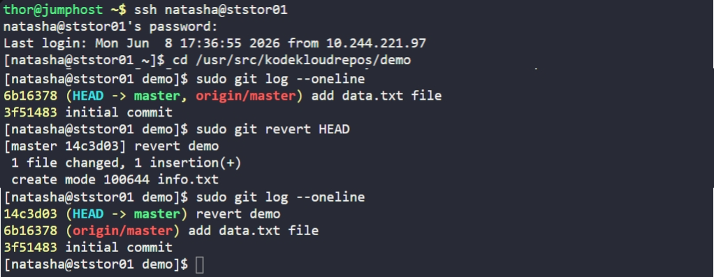

# Day 27: Git Revert Some Changes

## Objective
The Nautilus development team reported an issue with the latest changes in the `/usr/src/kodekloudrepos/demo` repository. The objective was to undo the most recent commit (HEAD) and return the repository to the state of the initial commit while maintaining a clear audit trail.


## 1. Identified the Commit History

```bash
cd /usr/src/kodekloudrepos/demo
sudo git log --oneline
```

**Observation:**
*   `6b16378` (HEAD): "add data.txt file" (The problematic commit)
*   `3f51483`: "initial commit" (The desired state)


## 2. Reverted the Latest Commit
Instead of using `git reset` (which deletes history), we used `git revert`. This creates a **new** commit that performs the exact opposite of the targeted commit, which is the best practice for shared repositories.

```bash
# Revert the latest changes and provide the specific commit message
sudo git revert HEAD
# (The message was then edited to "revert demo" as per requirements)
```

## 3. Verification
We verified the log again to ensure the revert commit was successfully created with the required lowercase message.

```bash
sudo git log --oneline
```

**Result:**
The log now shows a new `HEAD` commit:
`14c3d03 (HEAD -> master) revert demo`

The repository is now successfully restored to the initial state, and the faulty "data.txt" changes have been undone.


## Screenshot
