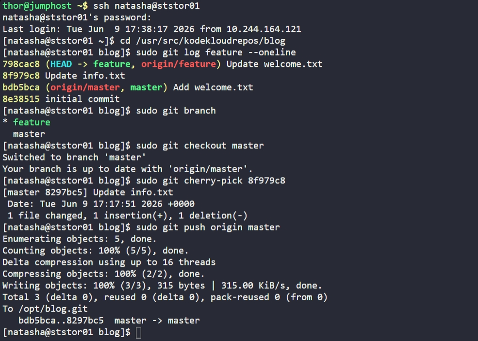

# Day 28: Git Cherry Pick

## Objective
The goal of this task was to move a specific piece of work from a development branch to production without merging the entire branch. Specifically, we needed to pull the "Update info.txt" commit from the `feature` branch into the `master` branch in the `/usr/src/kodekloudrepos/blog` repository.


## 1. Identified the Target Commit
After accessing the Storage Server, we inspected the `feature` branch to find the hash for the required commit message.

```bash
cd /usr/src/kodekloudrepos/blog
sudo git log feature --oneline
```
**Target Found:** `8f979c8` — "Update info.txt"


## 2. Applied the Cherry-Pick
We switched to the `master` branch and applied only that specific commit using its unique hash.

```bash
# Switch to the destination branch
sudo git checkout master

# Apply the specific commit
sudo git cherry-pick 8f979c8
```


## 3. Synchronized with Origin
Finally, we pushed the updated `master` branch back to the central bare repository (`/opt/blog.git`).

```bash
sudo git push origin master
```


## 4. Verification
We verified the `master` log to ensure the commit was successfully integrated.

```bash
sudo git log master --oneline
```
**Result:** Commit `8297bc5` (the cherry-picked version of `8f979c8`) is now at the head of the `master` branch.


## Screenshot
