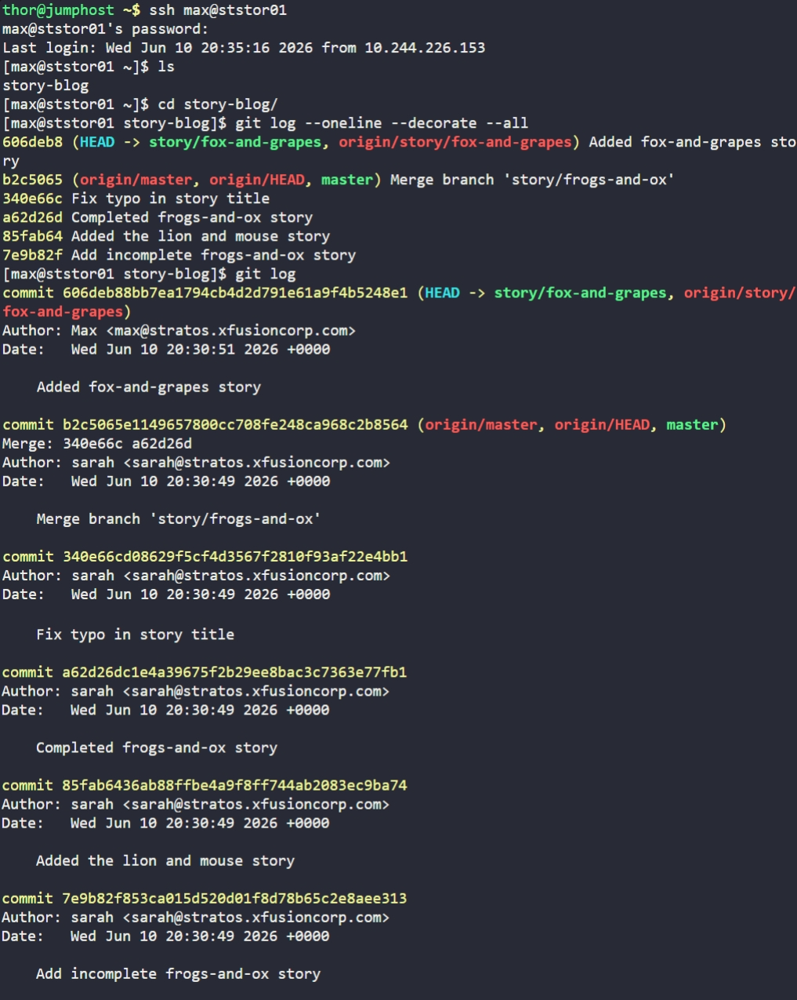
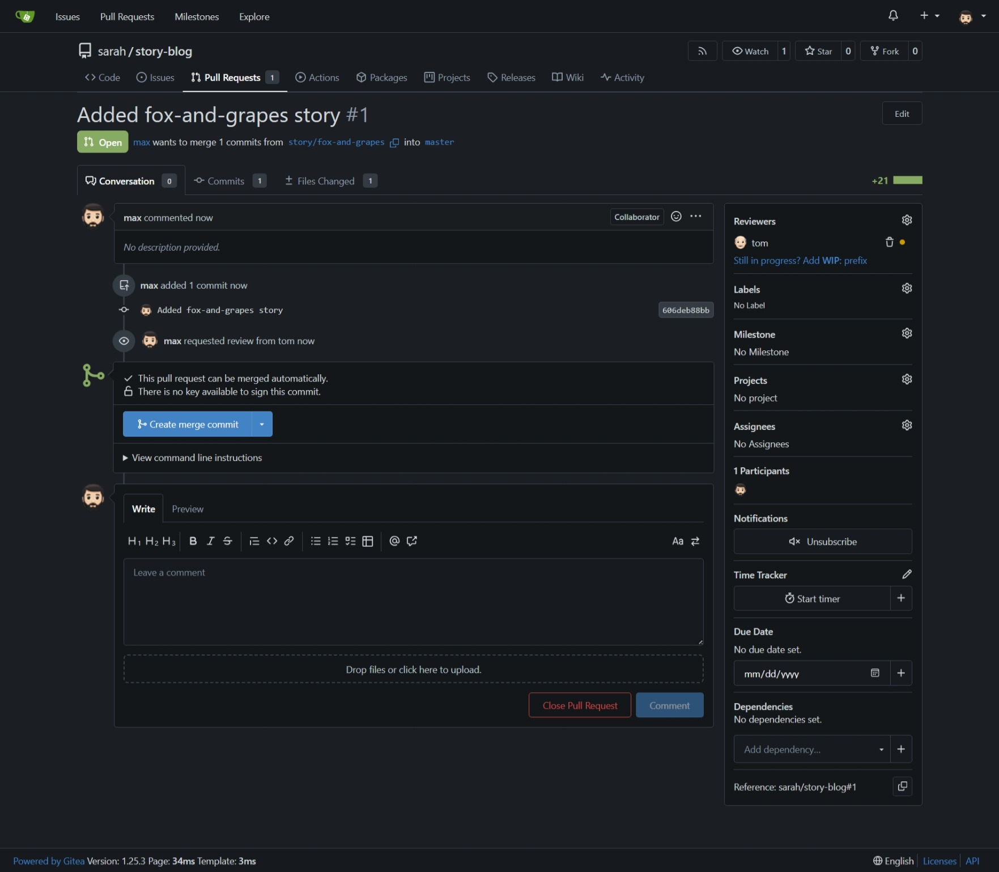
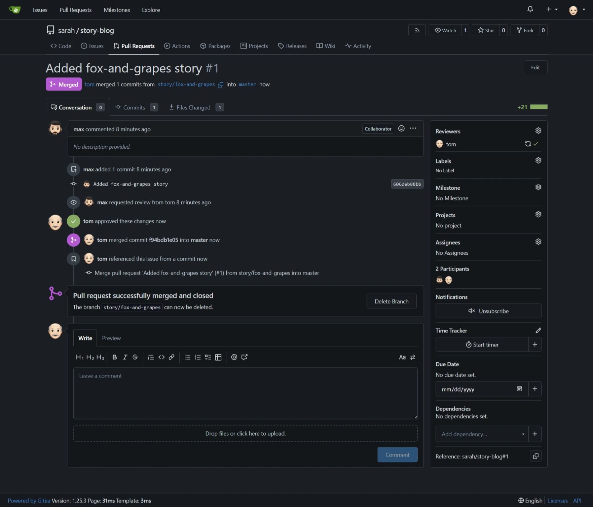

# Day 29: Manage Git Pull Requests

## Objective
Establish a protected branch workflow by merging a feature branch into `master` using a Gitea Pull Request (PR) with mandatory code review.

## 1. Create Pull Request (User: max)
- Logged into Gitea as **max**.
- Opened a new Pull Request for the `sarah/story-blog` repository.
  - **Source Branch:** `story/fox-and-grapes`
  - **Target Branch:** `master`
  - **Title:** `Added fox-and-grapes story`
- Assigned **tom** as the reviewer via the sidebar.

## 2. Review and Merge (User: tom)
- Logged into Gitea as **tom**.
- Navigated to the **Files Changed** tab of the PR to inspect the new content.
- Clicked **Review**, selected **Approve**, and submitted the review.
- Finalized the task by clicking **Create merge commit** to merge the changes into `master`.

## 3. Verification
- The Pull Request status changed to **Merged**.
- The `master` branch was updated with the new story while maintaining a clear audit trail of the approval.

## Screenshot

