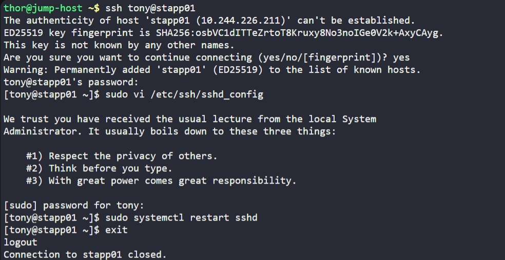

# Day 3: Secure Root SSH Access

## Objective

Disable direct SSH access for root user on all app servers

Direct root SSH login is disabled for security reasons.
- root cannot SSH directly
- users must login with normal user + sudo

## Steps (Example: App Server 1)

### 1. SSH into server

```bash
ssh tony@stapp01
```

### 2. Edit SSH config

```bash
sudo vi /etc/ssh/sshd_config
```

### 3. Set PermitRootLogin to no

```bash
PermitRootLogin no
```

### 4. Restart SSH service

```bash
sudo systemctl restart sshd
```

---

## Verification

```bash
grep PermitRootLogin /etc/ssh/sshd_config
```

Expected:

```
PermitRootLogin no
```

## Screenshot

