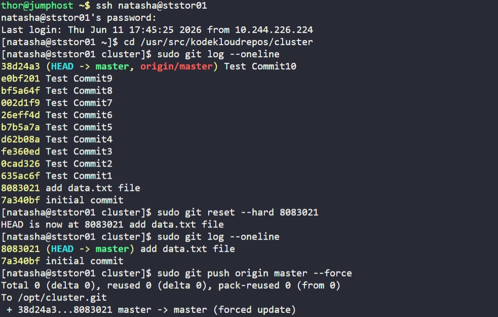

# Day 30: Git hard reset

## Objective
Clean up the test repository located at `/usr/src/kodekloudrepos/cluster` on the Storage Server by removing recent test commits and resetting the branch history to a specific state.

## 1. Identified Target State
After accessing the repository, we inspected the log to find the commit hash for "add data.txt file," which was intended to be the new HEAD.

```bash
cd /usr/src/kodekloudrepos/cluster
sudo git log --oneline
```
**Target Hash:** `8083021`

## 2. Performed Hard Reset
We used a **Hard Reset** to discard all commits made after the target hash. This action clears the commit history, the staging area, and the working directory simultaneously.

```bash
sudo git reset --hard 8083021
```

Unlike a `revert` (which adds a new commit to undo changes), a `reset --hard` moves the branch pointer backward in time, effectively deleting all history that came after the chosen commit.

## 3. Synchronized with Origin
Since the local history now contains fewer commits than the remote server (`origin`), a standard push would be rejected. We used a **Force Push** to overwrite the remote history with our cleaned local version.

```bash
sudo git push origin master --force
```

## 4. Verification
Confirmed the log now only contains the two required commits.

```bash
sudo git log --oneline
```

**Result:**
The repository is now clean, with the history limited to "initial commit" and "add data.txt file."

## Screenshot
