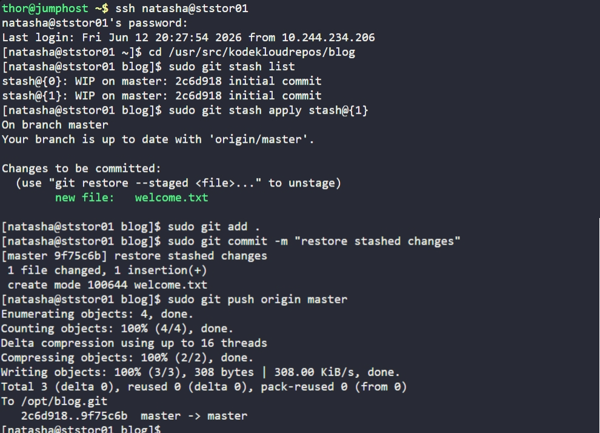

# Day 31: Git Stash


## Objective
The goal is to restore specific in-progress work from the Git stash in the `/usr/src/kodekloudrepos/blog` repository on the Storage Server. Specifically, we need to recover the changes associated with the `stash@{1}` identifier, commit them, and synchronize the repository with the central origin.


## 1. Identified and Restored the Stash

```bash
cd /usr/src/kodekloudrepos/blog
sudo git stash list
```

Then applied the specific changes from `stash@{1}` to the master branch.

```bash
sudo git stash apply stash@{1}
```


## 3. Committed and Pushed Changes

```bash
sudo git add .

sudo git commit -m "restore stashed changes"

sudo git push origin master
```


## Screenshot
