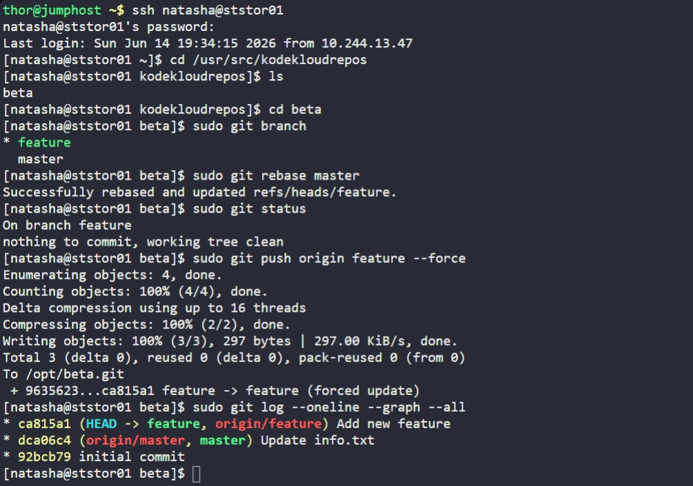

# Day 32: Git Rebase


## Objective
The objective was to update the `feature` branch in the `/usr/src/kodekloudrepos/beta` repository so that it includes the latest changes from the `master` branch. The requirement specifically requested a **Rebase** instead of a Merge to maintain a clean, linear commit history without adding unnecessary merge commits.

## 1. Connected to Storage Server and Repo
Logged into the Storage Server and moved into the repository directory.

```bash
ssh natasha@ststor01
cd /usr/src/kodekloudrepos/beta
```


## 2. Executed the Rebase
Verified we were on the `feature` branch and performed the rebase against the `master` branch.

```bash
# Apply master changes to the tip of the feature branch
sudo git rebase master
```


## 3. Pushed Changes to Origin
Since history was rewritten, we pushed the updated branch to the central repository (`/opt/beta.git`) using the force flag.

```bash
sudo git push origin feature --force
```


## 4. Verification
We utilized a graph log to confirm that the history is now linear and the `feature` branch sits directly on top of the latest `master` commit.

```bash
sudo git log --oneline --graph --all
```

**Result:**
The graph shows a clean sequence:
1. `initial commit`
2. `Update info.txt` (from master)
3. `Add new feature` (from feature)

The branch is now up-to-date and ready for further development.


## Screenshot
