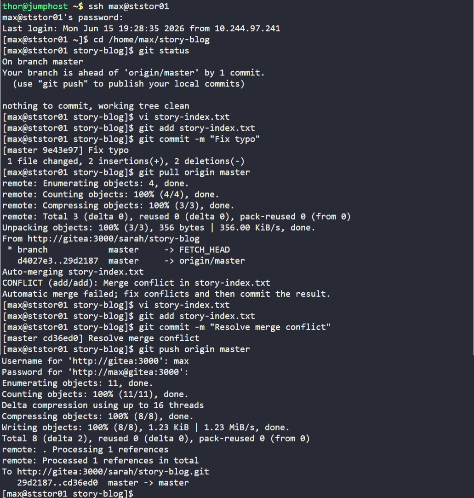

# Day 33: Resolve Git Merge Conflicts


## Objective
The objective was to update the `story-blog` repository on the Storage Server (`ststor01`) by correcting the `story-index.txt` file and resolving a merge conflict that occurred during synchronization with the Gitea server.

**Requirements:**
- The `story-index.txt` file must list all 4 story titles.
- Fix the typo: "Mooose" must be changed to **"Mouse"**.
- Push the changes to the origin.

## 1. Accessed Repository and Identified Requirements

```bash
ssh max@ststor01
cd /home/max/story-blog
```


## 2. Identified and Resolved Merge Conflict
While attempting to synchronize local work with the remote server, a **Merge Conflict** occurred because another team member had modified the same file.

```bash
git pull origin master
# Result: CONFLICT (add/add): Merge conflict in story-index.txt
```

**Action taken:**
We manually opened the file and resolved the conflict by removing the Git markers (`<<<<<<<`, `=======`, `>>>>>>>`) and ensuring the content matched the final requirement


## 3. Finalized Changes
Once the conflict was resolved and the data was corrected, we staged the file, committed the resolution, and pushed to the Gitea repository.

```bash
git add story-index.txt
git commit -m "Resolve merge conflict"
git push origin master
```


## 4. Verification
Confirmed the successful update through the following indicators:
- **Terminal:** `git push` returned a successful completion message.
- **Gitea UI:** Logged into the Gitea web interface as `max` and verified that the `master` branch now contains the clean, correctly spelled list of 4 stories.

## Screenshot
