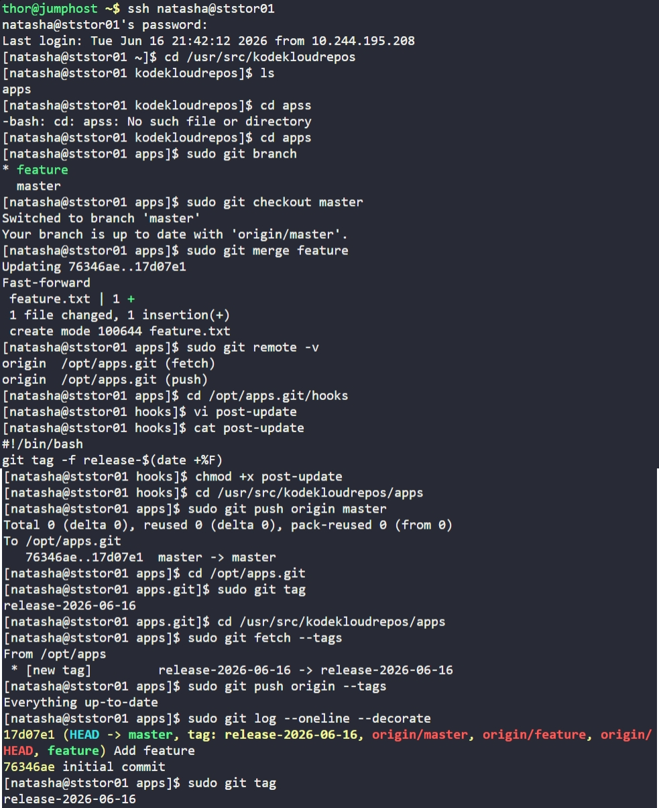

# Day 34: Git Hook


## Objective
Automate the creation of release tags whenever changes are pushed to the central repository. The task required merging a `feature` branch into `master` and configuring a server-side `post-update` hook.


## 1. Merged Feature into Master
Logged into the Storage Server and synchronized the local development branch.

```bash
cd /usr/src/kodekloudrepos/apps
sudo git checkout master
sudo git merge feature
```


## 2. Configured the Server-Side Hook
We moved to the central bare repository to create a **post-update** hook. This script triggers automatically after a successful push to the server.

```bash
cd /opt/apps.git/hooks
sudo vi post-update
```

**Hook Script Content:**
```bash
#!/bin/bash
# Automatically create/update a tag with the current date
git tag -f release-$(date +%F)
```

**Set Executable Permissions:**
```bash
sudo chmod +x post-update
```


## 3. Triggered and Tested the Hook
Returned to the cloned repository and pushed the merged changes to the origin. This push event triggered the hook on the server.

```bash
cd /usr/src/kodekloudrepos/apps
sudo git push origin master
```


## 4. Verification
We verified that the hook correctly generated the release tag on the central Git server.

```bash
# Check tags on the central server
cd /opt/apps.git
sudo git tag

# Result: release-2026-06-16
```

Finally, we fetched the tags back to the local repository to ensure full synchronization:
```bash
sudo git fetch --tags
sudo git log --oneline --decorate
```

**Result:** The repository now has an automated tagging system that ensures every push to master is marked with a timestamped release tag.


## Screenshot
