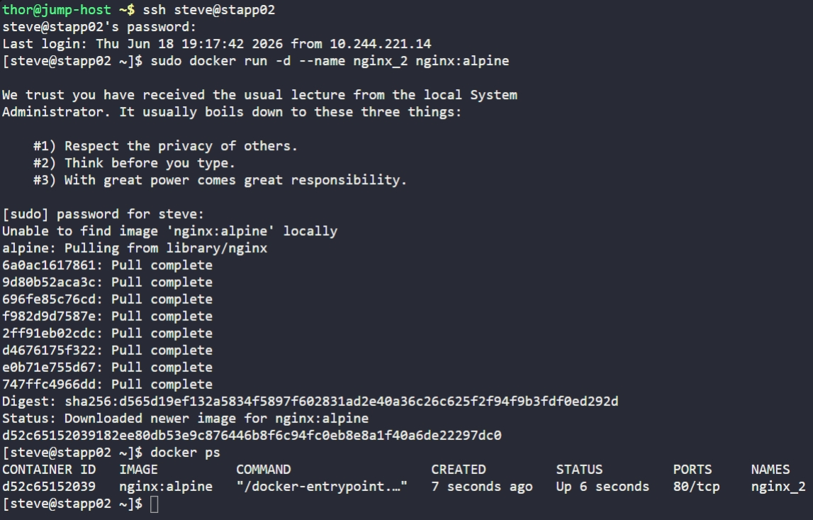

# Day 36: Deploy Nginx Container on Application Server

## Objective
Deploy a lightweight Nginx container on App Server 2 (`stapp02`) to test containerization capabilities within the Stratos Datacenter.

## 1. Connected to App Server 2

```bash
ssh steve@stapp02
```

## 2. Deployed Nginx Container
Created and started the container in detached mode using the official Alpine-based Nginx image.

```bash
sudo docker run -d --name nginx_2 nginx:alpine
```

**Command Breakdown:**
- `-d`: Runs the container in the background (detached mode).
- `--name nginx_2`: Assigns the specific name required by the task.
- `nginx:alpine`: Utilizes the `alpine` tag for a minimal footprint image.

## 3. Verification
Confirmed the container is in a running state and assigned the correct name.

```bash
docker ps
```

**Result:**
The container `nginx_2` is successfully running on port 80 (internal) and is ready for traffic.

## Screenshot
