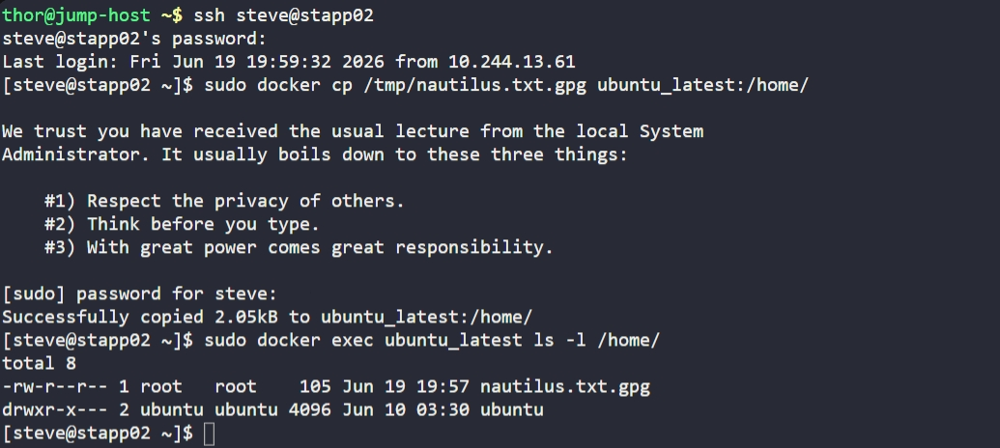

# Day 37: Copy File to Docker Container

## Objective
The objective was to transfer a sensitive, encrypted file (`nautilus.txt.gpg`) from the host filesystem of App Server 2 (`stapp02`) into a specific directory within a running Docker container named `ubuntu_latest`.

## 1. Access the Docker Host

```bash
ssh steve@stapp02
```

## 2. Execute File Copy to Container
Utilized the `docker cp` command to perform a direct transfer from the host's `/tmp` directory to the container's `/home/` path.

```bash
sudo docker cp /tmp/nautilus.txt.gpg ubuntu_latest:/home/
```

**Why this command?**
The `docker cp` utility allows for the movement of files between the host and containers without needing to establish SSH or network connections to the container itself. It preserves the binary integrity of the file, ensuring the encrypted data is not corrupted during the move.

## 3. Verification
Executed a command inside the container to confirm the file was successfully placed and to check its attributes.

```bash
sudo docker exec ubuntu_latest ls -l /home/
```

**Result:**
The file `nautilus.txt.gpg` is now present in the container at `/home/nautilus.txt.gpg`. The file size and permissions confirm a successful, unmodified transfer.

## Screenshot
