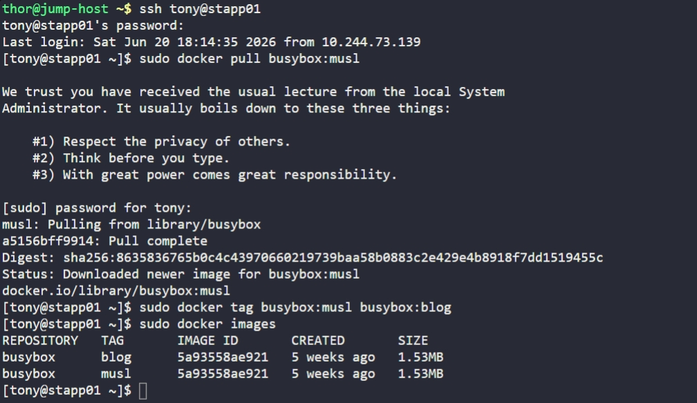

# Day 38: Pull Docker Image

## Objective
Fetch a specific lightweight image from the Docker registry onto App Server 1 (`stapp01`) and apply a custom tag to meet the project's naming conventions for the development team.

## 1. Pulled Target Image

```bash
ssh tony@stapp01
sudo docker pull busybox:musl
```

`busybox` is a minimal executable that provides many standard Unix utilities, making it ideal for testing container features with a very small footprint.

## 2. Retagged the Image
Created a new alias (tag) for the downloaded image. This allows the development team to reference the image as `busybox:blog` while maintaining the underlying versioning.

```bash
sudo docker tag busybox:musl busybox:blog
```

## 3. Verification
Confirmed the presence of both tags using the images list command.

```bash
sudo docker images
```

## Screenshot
