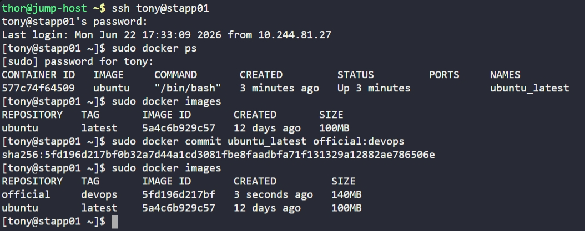

# Day 39: Create a Docker Image From Container


## Objective
The objective was to create a persistent backup of a developer's changes by converting a running Docker container into a new, reusable image named `official:devops` on App Server 1.

## 1. Identified the Source Container
Logged into App Server 1 and verified the status of the running container.

```bash
ssh tony@stapp01
sudo docker ps
```
**Source Container:** `ubuntu_latest` (ID: `577c74f64509`)

## 2. Committed Changes to a New Image
Used the `docker commit` command to capture the container's current state—including any installed tools or configuration changes—into a new image.

```bash
sudo docker commit ubuntu_latest official:devops
```

`docker commit` is useful for checkpointing a container during an interactive development session. It saves the read-write layer of the container into a new read-only image layer.

## 3. Verification
Verified that the new image was successfully created and added to the local repository.

```bash
sudo docker images
```

**Result:**
The new image `official:devops` is now available with a size of **140MB**. The increase in size compared to the original 100MB `ubuntu:latest` base image confirms that the developer's changes were successfully captured.

## Screenshot
