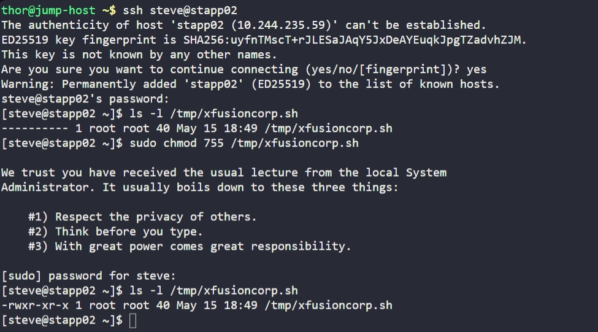

# Day 4: Script Execution Permissions

## Objective

Grant executable permissions to `/tmp/xfusioncorp.sh` on App Server 2 so that all users can execute it.

## Steps Performed

### 1. SSH into App Server 2

```bash
ssh steve@stapp02
```

### 2. Check current permissions

```bash
ls -l /tmp/xfusioncorp.sh
```

### 3. Add execute permission for all users

```bash
sudo chmod 755 /tmp/xfusioncorp.sh
```

## Verification

```bash
ls -l /tmp/xfusioncorp.sh
```

Expected change:

```
-rwxr-xr-x
```

## Screenshot

