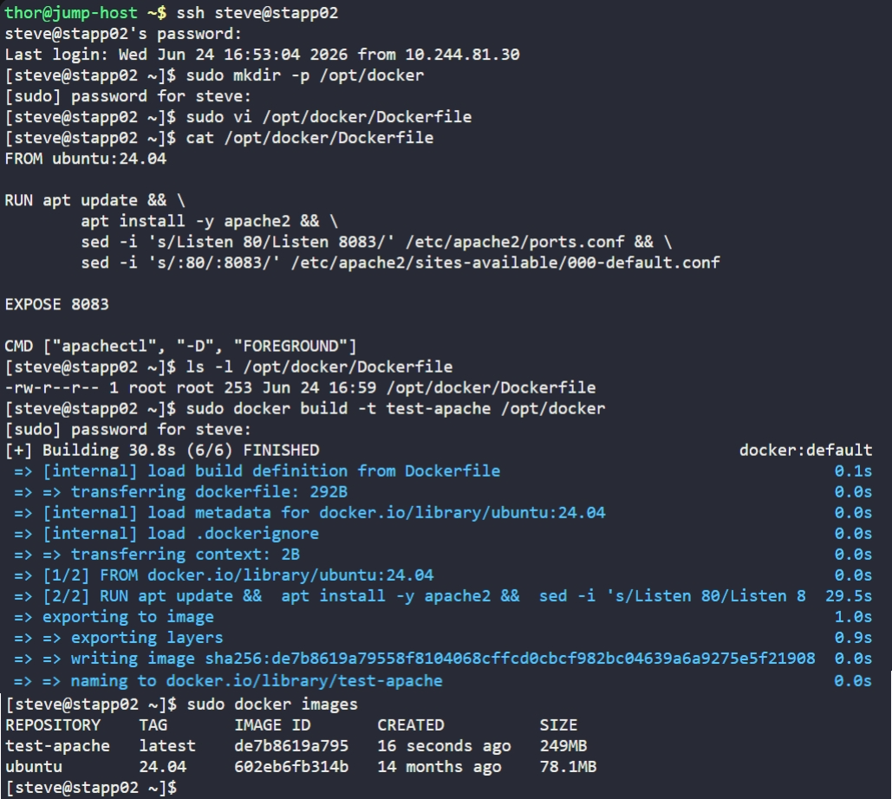

# Day 41: Write a Docker File


## Objective
The objective was to create a custom Docker image on App Server 2 (`stapp02`) based on Ubuntu 24.04, configured to run the Apache web server on a non-standard port (**8083**).


## 1. Created the Dockerfile
We created the directory and the `Dockerfile` with the specific instructions required by the development team.

```bash
ssh steve@stapp02
sudo mkdir -p /opt/docker
sudo vi /opt/docker/Dockerfile
```

**Dockerfile:**
```dockerfile
FROM ubuntu:24.04

# Install Apache and modify ports in one layer
RUN apt update && \
    apt install -y apache2 && \
    sed -i 's/Listen 80/Listen 8083/' /etc/apache2/ports.conf && \
    sed -i 's/:80/:8083/' /etc/apache2/sites-available/000-default.conf

# Document that the container listens on 8083
EXPOSE 8083

# Keep the container alive by running Apache in the foreground
CMD ["apachectl", "-D", "FOREGROUND"]
```

In a standard Linux server, services like Apache run in the background as "daemons." However, **a Docker container only lives as long as its main process (PID 1) is running.**

If we simply ran `service apache2 start` in the Dockerfile:
1.  The container starts.
2.  Apache starts and immediately moves itself to the background.
3.  The main process finishes because it thinks its job is done.
4.  **The container stops immediately.**

To prevent this, we use `apachectl -D FOREGROUND`. This forces Apache to stay in the "foreground," making it the container's main process and keeping the container alive.


## 2. Configuration Breakdown
*   **`FROM ubuntu:24.04`**: Sets the official Ubuntu LTS as our foundation.
*   **`RUN`**: Updates the package list, installs Apache, and uses `sed` to replace the default port 80 with **8083** in both the listener and the default VirtualHost file.
*   **`EXPOSE 8083`**: Tells Docker that the container will listen on this port at runtime.
*   **`CMD`**: The final instruction that executes when the container is launched from this image.


## 3. Verification
We verified the file was created in the correct location with the exact naming convention required.

```bash
cat /opt/docker/Dockerfile
```

**Result:**
The Dockerfile is ready to be used for an image build (`docker build -t test-apache /opt/docker`), ensuring the application will run securely on port 8083.


## Screenshot
