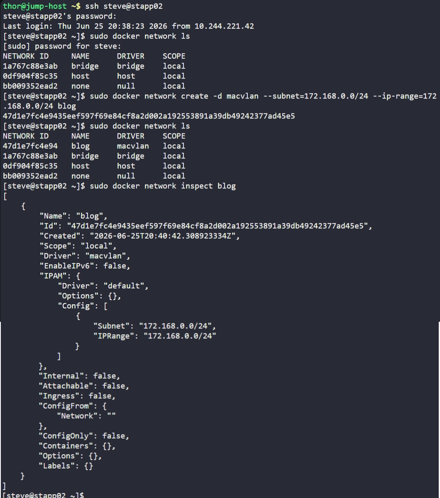

# Day 42: Create a Docker Network

## Objective
The objective was to provision a high-performance Docker network named `blog` on App Server 2 (`stapp02`) using the **macvlan** driver and specific IP addressing requirements.


## 1. Architectural Theory: Macvlan Driver
Standard Docker networks use a "bridge," which acts like a virtual switch inside the host. 

**Macvlan** is different. It allows us to assign a MAC address to a container, making it appear as a **physical device** directly connected to the network. This way Containers can communicate directly with the underlying physical network without using the Docker host's bridge or NAT.


## 2. Created the Network
We used the `docker network create` command with specific flags to define the driver and the IP address management (IPAM) configuration.

```bash
ssh steve@stapp02
sudo docker network create \
  -d macvlan \
  --subnet=172.168.0.0/24 \
  --ip-range=172.168.0.0/24 \
  blog
```

**Flag Breakdown:**
- `-d macvlan`: Specifies the use of the Macvlan driver.
- `--subnet`: Defines the network segment (the range of available IPs).
- `--ip-range`: Limits the specific block of IPs from the subnet that Docker can assign to containers.


## 3. Verification
We confirmed the network creation by listing all available networks and then inspecting the detailed configuration of the `blog` network.

```bash
# List networks
sudo docker network ls

# Inspect specific network details
sudo docker network inspect blog
```

**Result:**
The `inspect` output confirmed that the network was successfully initialized with the correct driver (`macvlan`) and the exact subnet/ip-range requested (**172.168.0.0/24**).


## Screenshot
