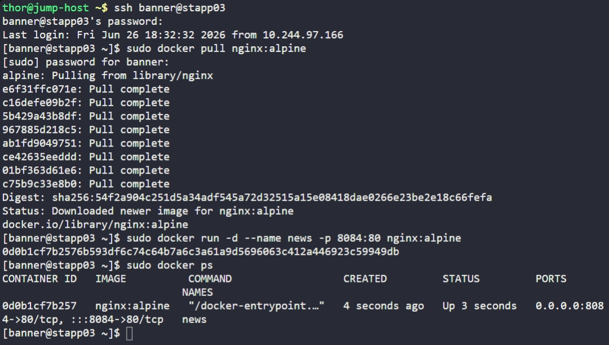

# Day 43: Docker Ports Mapping


## Objective
Host a web application using Nginx in a Docker container on App Server 3 (`stapp03`). The container must be accessible via a custom host port by mapping it to the container's internal service port.

By default, services running inside a Docker container are isolated and cannot be reached from outside the Docker host. 

**Port Mapping (`-p host_port:container_port`)** creates a "tunnel" through the host's firewall:
- **Host Port (8084):** The port external users connect to on the server's IP.
- **Container Port (80):** The port the service (Nginx) is actually listening on inside the container.


## 1. Pulled Required Image

```bash
ssh banner@stapp03
sudo docker pull nginx:alpine
```


## 3. Deployed Container with Mapping
We launched the container in detached mode, assigned the required name, and configured the port redirection.

```bash
sudo docker run -d --name news -p 8084:80 nginx:alpine
```

- `-d`: Runs the container in the background.
- `--name news`: Assigns the unique identifier requested.
- `-p 8084:80`: Forwards traffic from the server's port 8084 to the container's port 80.


## 4. Verification
Confirmed the container status and the active port mapping.

```bash
sudo docker ps
```

**Result:**
The output shows `0.0.0.0:8084->80/tcp`. This confirms that any request hitting App Server 3 on port **8084** will be successfully handled by the Nginx process inside the **news** container.


## Screenshot
