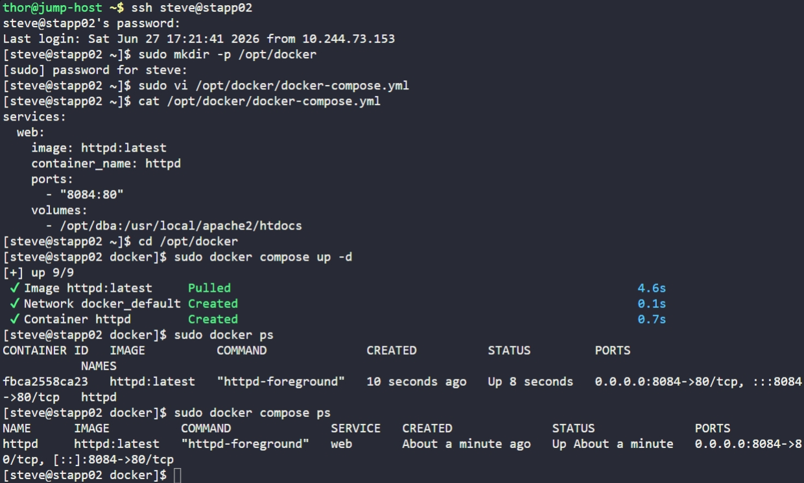

# Day 44: Write a Docker Compose File


## Objective
The objective was to deploy an Apache (`httpd`) web server on App Server 2 (`stapp02`) using **Docker Compose**. The setup required mapping a specific host directory to the container's document root to serve pre-existing static content and exposing the service via a custom host port.


## 1. Created the Project Directory
Logged into App Server 2 and created a dedicated directory to house the orchestration file.

```bash
ssh steve@stapp02
sudo mkdir -p /opt/docker
```


## 2. Developed the Docker Compose File
We created the `docker-compose.yml` file with the exact specifications requested by the development team.

```bash
sudo vi /opt/docker/docker-compose.yml
```

**File Content:**
```yaml
services:
  web:
    image: httpd:latest
    container_name: httpd
    ports:
      - "8084:80"
    volumes:
      - /opt/dba:/usr/local/apache2/htdocs
```


## 3. Deployed the Container
We utilized the Docker Compose plugin to pull the image and start the service in detached mode.

```bash
cd /opt/docker
sudo docker compose up -d
```


## 4. Verification
Confirmed the operational status, name, and port mapping of the container.

```bash
sudo docker ps
```

**Result:**
The container `httpd` is successfully running. Requests to App Server 2 on port **8084** are now routed to the container's port **80**, which is serving the data found in `/opt/dba`.


## Screenshot
