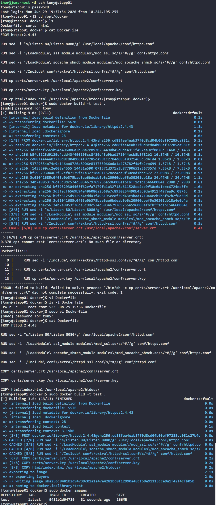

# Day 45: Resolve Dockerfile Issues


## Objective
The goal was to troubleshoot and fix a failing `Dockerfile` on App Server 1 (`stapp01`). The build was crashing because it attempted to use standard shell commands to move local host files into the image incorrectly.

The primary issue in the original Dockerfile was the use of `RUN cp ...`. 

*   **`RUN`**: executes commands **inside** the temporary container environment during the build process. Because the certificates and HTML files were sitting on the server's hard drive (the host), the `cp` command inside the container couldn't see them, resulting in a "No such file or directory" error.
*   **`COPY`**: bridges the gap between the **Host** and the **Image**. It takes files from the build context (the current directory on the server) and injects them into the image layers.


## 1. Identified the Build Failure
Logged into App Server 1 and attempted to build the image to identify the breaking point.

```bash
ssh tony@stapp01
cd /opt/docker
sudo docker build -t test .
```

**Observation:** The build failed at Step 6/8 with the error:
`cp: cannot stat 'certs/server.crt': No such file or directory`


## 2. Corrected the Dockerfile
Modified `/opt/docker/Dockerfile` to use the correct Docker instructions for file management and ensured the paths were accurate.

**Changes applied:**
Converted all file transfer lines from `RUN cp` to `COPY`.

**Final Dockerfile Content:**
```dockerfile
FROM httpd:2.4.43

# Update port to 8080
RUN sed -i "s/Listen 80/Listen 8080/g" /usr/local/apache2/conf/httpd.conf

# Enable SSL and cache modules
RUN sed -i '/LoadModule\ ssl_module modules\/mod_ssl.so/s/^#//g' conf/httpd.conf
RUN sed -i '/LoadModule\ socache_shmcb_module modules\/mod_socache_shmcb.so/s/^#//g' conf/httpd.conf
RUN sed -i '/Include\ conf\/extra\/httpd-ssl.conf/s/^#//g' conf/httpd.conf

# Inject host files into the image correctly
COPY certs/server.crt /usr/local/apache2/conf/server.crt
COPY certs/server.key /usr/local/apache2/conf/server.key
COPY html/index.html /usr/local/apache2/htdocs/
```


## 3. Final Verification
Reran the build command to confirm the fix.

```bash
sudo docker build -t test .
```

The image is now correctly configured with custom ports, enabled SSL modules, and the required static content.


## Screenshot
