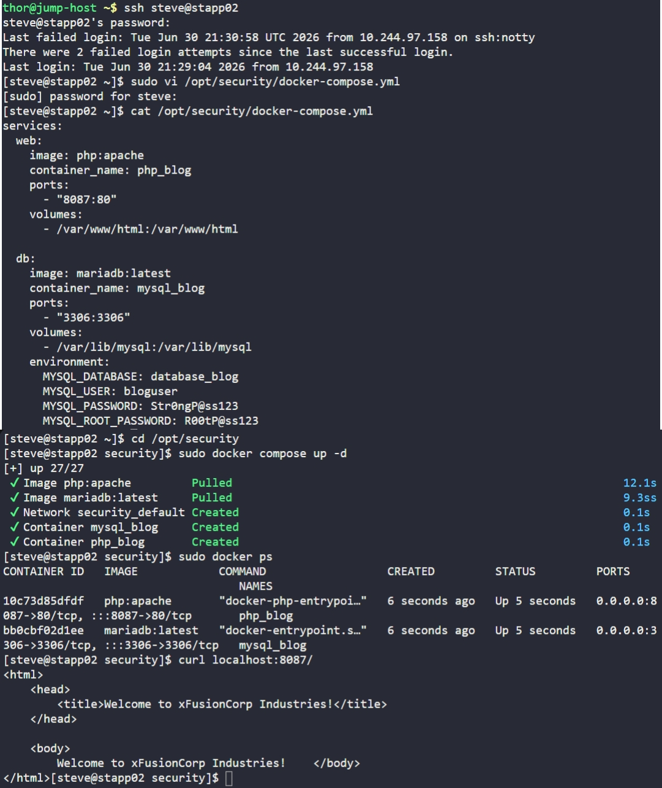

# Day 46: Deploy an App on Docker Containers


## Objective
The objective was to deploy a containerized application (PHP Web + MariaDB Database) on App Server 2 (`stapp02`) using **Docker Compose**. The setup required orchestrating two services, ensuring persistent storage for application data and database records, and exposing the web interface via a custom host port.


## 1. Environment Preparation
Logged into App Server 2 and created the dedicated configuration directory.

```bash
ssh steve@stapp02
sudo mkdir -p /opt/security
cd /opt/security
```


## 2. Created the Docker Compose File
We created the `/opt/security/docker-compose.yml` file to define the `web` and `db` services as per the requirements.

```bash
sudo vi docker-compose.yml
```

**Configuration Breakdown:**
```yaml
services:
  web:
    image: php:apache
    container_name: php_blog
    ports:
      - "8087:80"
    volumes:
      - /var/www/html:/var/www/html

  db:
    image: mariadb:latest
    container_name: mysql_blog
    ports:
      - "3306:3306"
    volumes:
      - /var/lib/mysql:/var/lib/mysql
    environment:
      MYSQL_DATABASE: database_blog
      MYSQL_USER: bloguser
      MYSQL_PASSWORD: Str0ngP@ss123
      MYSQL_ROOT_PASSWORD: R00tP@ss123
```


## 3. Deployed the Stack
We initialized the deployment in detached mode.

```bash
sudo docker compose up -d
```


## 4. Verification
Confirmed that both containers are in a "Running" state and that the web server was serving the correct content.

```bash
# Check container status
sudo docker ps

# Local verification of the web service
curl localhost:8087/
```

### Result
The `curl` command returned the HTML content:
```html
<html>
<head>
    <title>Welcome to xFusionCorp Industries!</title>
</head>
<body>
    Welcome to xFusionCorp Industries!
</body>
</html>
```

The stack is successfully deployed and the application is now reachable via the host's port **8087**.


## Screenshot
