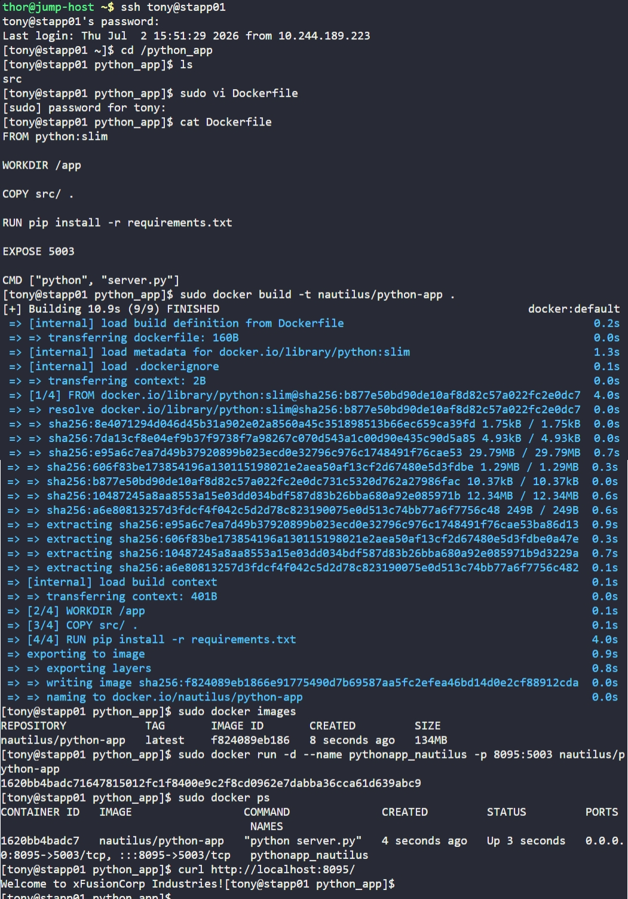

# Day 47: Docker Python App


## Objective
The objective was to Dockerize a Python-based application and deploy it on App Server 1 (`stapp01`). This involved creating a custom `Dockerfile` to handle dependencies, building a specific image, and launching a container with proper port mapping.


## 1. Created the Dockerfile
We created the `Dockerfile` in the `/python_app` directory to automate the image build process.

```dockerfile
# Use a lightweight official Python image
FROM python:slim

# Set the working directory inside the container
WORKDIR /app

# Copy the source code (including requirements.txt and server.py)
COPY src/ .

# Install the application dependencies
RUN pip install -r requirements.txt

# Document the port the app listens on
EXPOSE 5003

# Command to start the application
CMD ["python", "server.py"]
```


## 2. Built the Docker Image
We built the image using the specified naming convention.

```bash
sudo docker build -t nautilus/python-app .
```


## 3. Deployed the Container
We launched the container in detached mode, mapping the internal application port to the requested host port.

```bash
sudo docker run -d --name pythonapp_nautilus -p 8095:5003 nautilus/python-app
```


## 4. Verification
We verified the deployment by performing a local HTTP request to the host port.

```bash
curl http://localhost:8095/
```

### Result
The application responded successfully:
`Welcome to xFusionCorp Industries!`

The Python app is now fully containerized, port-mapped, and running as a background service on App Server 1.


## Screenshot
