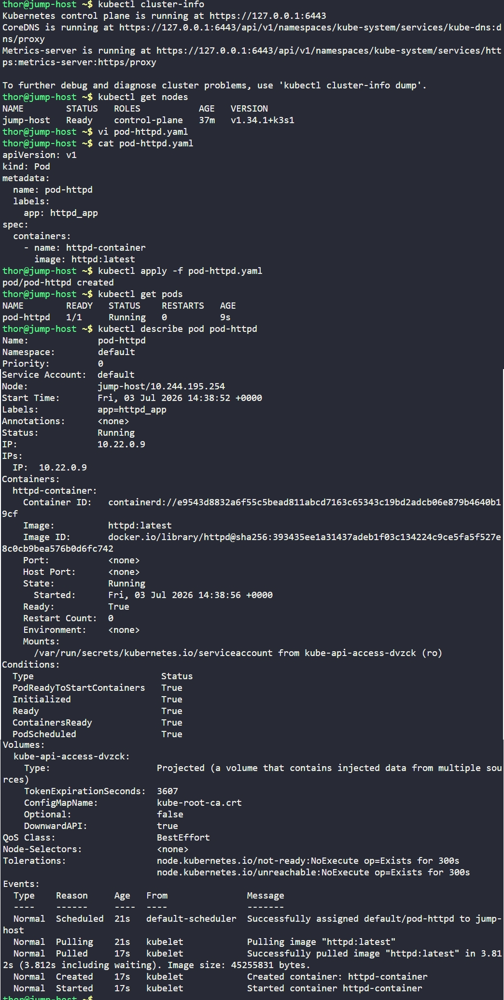

# Day 48: Deploy Pods in Kubernetes Cluster

## Objective
Begin the transition to Kubernetes for application orchestration by deploying a standalone Pod on the Nautilus Kubernetes cluster. The task requires specific naming conventions, labels for resource tracking, and utilizing the latest official images.


## 1. What is a Pod?
In Kubernetes, a **Pod** is the smallest and simplest unit in the Kubernetes object model that we create or deploy.
*   **Encapsulation:** A Pod represents a single instance of a running process in r cluster. It encapsulates one or more containers (such as Docker containers), storage resources, and a unique network IP.
*   **Ephemeral Nature:** Pods are designed to be ephemeral. If a Pod fails, Kubernetes (specifically controllers like Deployments) usually replaces it rather than trying to fix it.


## 2. Cluster Health Check
Before deployment, we verified that the Kubernetes control plane and nodes were operational using the `kubectl` utility on the jump-host.

```bash
kubectl cluster-info
kubectl get nodes
```
**Observation:** The cluster is running version `v1.34.1` with the `jump-host` acting as the control-plane node.


## 3. Developed the Pod Manifest
We created a declarative YAML manifest named `pod-httpd.yaml` to define the desired state of the Pod.

```bash
vi pod-httpd.yaml
```

**Manifest Content:**
```yaml
apiVersion: v1
kind: Pod
metadata:
  name: pod-httpd
  labels:
    app: httpd_app
spec:
  containers:
    - name: httpd-container
      image: httpd:latest
```

**Key Components:**
*   **`metadata.labels`**: Assigned `app: httpd_app`. Labels are key-value tags we attach to objects so you can find or group them.
*   **`spec.containers.name`**: Set to `httpd-container` as per requirements.
*   **`spec.containers.image`**: Specified `httpd:latest` to ensure the most recent version of Apache is pulled.


## 4. Deployed and Verified the Pod
We applied the manifest to the cluster and inspected the Pod.

```bash
# Create the pod
kubectl apply -f pod-httpd.yaml

# Check running status
kubectl get pods

kubectl describe pod pod-httpd
```

### Result
The Pod successfully transitioned through the `Pending` and `ContainerCreating` phases to a **Running** state. 

**Technical Details from `describe`:**
- **Status:** `Running`
- **IP:** `10.22.0.9`
- **Events:** Successfully pulled image "httpd:latest" and started container "httpd-container".

The environment is now ready, and the web server is operational within the Kubernetes cluster.


## Screenshot
