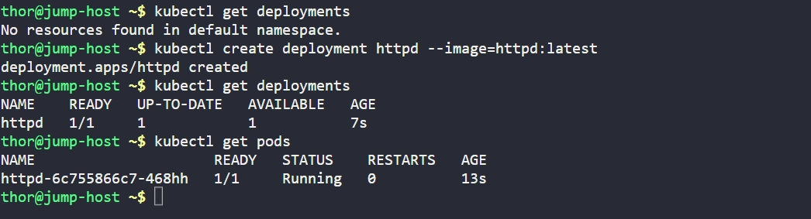

# Day 49: Deploy Applications with Kubernetes Deployments

## Objective
The goal is to transition from standalone Pods to **Deployments** for better application management. Deployments provide declarative updates for Pods and ReplicaSets, allowing for easier scaling and self-healing.

## 1. Create the Deployment
We used an imperative command to quickly create the deployment with the specified image.

```bash
kubectl create deployment httpd --image=httpd:latest
```

## 2. Deployment vs. Pod

While a **Pod** is a single instance, a **Deployment** acts as a manager. 
- If the Pod created by this deployment is deleted or crashes, the Deployment controller will automatically notice the discrepancy and spin up a new Pod to maintain the desired state.
- Deployments allow for zero-downtime updates (Rolling Updates).

## 3. Verification
Confirmed the deployment is active and the associated Pod is running.

```bash
# Check Deployment status
kubectl get deployments

# Check the Pod created by the deployment
kubectl get pods
```

**Result:**
The deployment `httpd` is successfully created. Kubernetes automatically generated a ReplicaSet and a Pod (e.g., `httpd-6c755866c7-468hh`) to host the application.

## Screenshot
