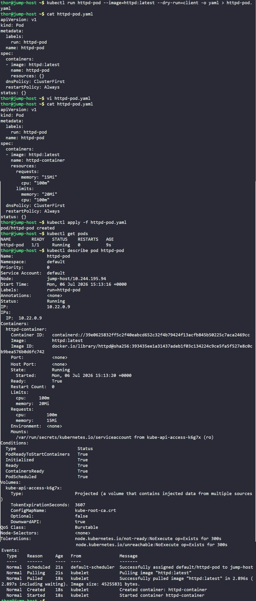

# Day 50: Set Resource Limits in Kubernetes Pods

## Objective
To ensure cluster stability and prevent a single application from consuming all node resources, we configured specific CPU and Memory **Requests** and **Limits** for an Apache (`httpd`) pod.

*   **Requests (The Floor):** are the minimum a container needs, used by Kubernetes to pick a node with enough room to run it. If a node has 100MB of RAM left and our pod requests 150MB, Kubernetes will not put the pod on that node. It’s like a "reservation."
*   **Limits (The Ceiling):** This is the **maximum allowed** resource.
    *   **Memory Limit:** If the container tries to use more than **20Mi**, Kubernetes will **kill it** (OOMKilled - Out of Memory).
    *   **CPU Limit:** If the container tries to use more than **100m**, Kubernetes will **throttle it** (slow it down), but it won't necessarily kill the pod. It just won't let it go faster.

Without a limit, a bug in our app (like a memory leak or infinite loop) could let one container eat up all the CPU/memory on its node — crashing every other pod sharing that node, even healthy ones that had nothing to do with the problem. Setting a limit contains that failure to just the one misbehaving container instead of taking down the whole node.

## 1. Generated Pod Manifest
We used the "dry-run" method to generate a clean YAML template for the pod.

```bash
kubectl run httpd-pod --image=httpd:latest --dry-run=client -o yaml > httpd-pod.yaml
```


## 2. Configured Resource Constraints
We edited the `httpd-pod.yaml` file to define the `resources` block under the container specification.

**Updated Manifest Block:**
```yaml
spec:
  containers:
  - image: httpd:latest
    name: httpd-container
    resources:
      requests:
        memory: "15Mi"
        cpu: "100m"
      limits:
        memory: "20Mi"
        cpu: "100m"
```

**Note on Units:**
- `100m` stands for **100 millicores** (0.1 of a CPU core).
- `Mi` stands for **Mebibytes**.


## 3. Deployed and Inspected the Pod
We applied the declarative manifest to the cluster.

```bash
kubectl apply -f httpd-pod.yaml
```


## 4. Verification
We utilized the `describe` command to ensure the constraints were active and recognized by the kubelet.

```bash
kubectl describe pod httpd-pod
```

### Result
The pod is in a **Running** state with the following resource profile:
- **Requests/Limits:** Verified as 100m CPU and 15Mi/20Mi Memory.

The application is now "sandboxed," ensuring it has enough resources to start but cannot grow large enough to destabilize the rest of the cluster.


## Screenshot
