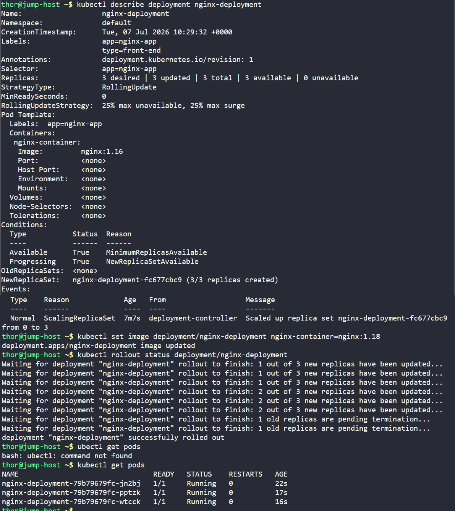

# Day 51: Execute Rolling Updates in Kubernetes


## Objective
Update the existing `nginx-deployment` from version **1.16** to version **1.18** using a **Rolling Update** strategy. The goal is to deploy the new application changes without causing downtime for the end users.


## 1. Rolling Updates
A **Rolling Update** is the default deployment strategy in Kubernetes. It allows for an update of a Deployment to take place with zero downtime by incrementally replacing old Pods with new ones.

**How it works (based on your output):**
- **Max Surge:** Kubernetes spins up a new Pod before killing an old one.
- **Max Unavailable:** It ensures a certain number of Pods remain "Ready" at all times to handle traffic.
- If the new Pod fails to start, Kubernetes stops the rollout, preventing a total application failure.


## 2. Inspected the Current Deployment
Before the update, we verified the container name and the current image version.

```bash
kubectl describe deployment nginx-deployment
```
**Current Image:** `nginx:1.16`
**Container Name:** `nginx-container`


## 3. Triggered the Image Update
We used the `set image` command to instruct the deployment controller to begin the rollout.

```bash
kubectl set image deployment/nginx-deployment nginx-container=nginx:1.18
```


## 4. Monitored the Rollout Progress
We tracked the state transition in real-time to ensure the new replicas were becoming healthy before the old ones were terminated.

```bash
kubectl rollout status deployment/nginx-deployment
```

**Observation:**
The terminal output clearly showed the step-by-step transition:
1. `1 out of 3 new replicas have been updated...`
2. `Waiting for 1 old replicas are pending termination...`
3. `deployment "nginx-deployment" successfully rolled out`


## 5. Verification
Confirmed that all three replicas are now running the new version and are in a healthy state.

```bash
kubectl get pods
```

### Result
The deployment was successfully updated to **nginx:1.18**. The new Pods (with the hash `79b79679fc`) replaced the old ones seamlessly, maintaining the desired count of 3 operational instances throughout the process.


## Screenshot
