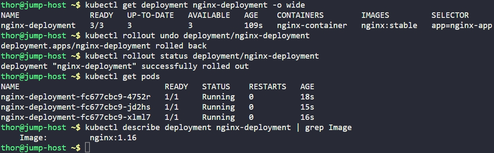

# Day 52: Revert Deployment to Previous Version in Kubernetes

## Objective
The objective was to perform an emergency rollback of the `nginx-deployment` in the Nautilus Kubernetes cluster. Following a reported bug in the latest release, the DevOps team needed to revert the application to its previous stable state without manual re-configuration.


## 1. Identified Current State
Before reverting, we verified the current image running in the cluster which was reported as buggy.

```bash
kubectl get deployment nginx-deployment -o wide
```
**Current (Buggy) Image:** `nginx:stable`


## 2. Triggered the Rollback
We executed the `rollout undo` command. This instructed Kubernetes to terminate the pods running the old image and spin up pods using the previous known good configuration.

```bash
kubectl rollout undo deployment/nginx-deployment
```


## 3. Monitored the Reversion
We tracked the status to ensure the pods successfully transitioned back to the stable version.

```bash
kubectl rollout status deployment/nginx-deployment
```

## 5. Verification
We performed a check on the deployment metadata to confirm the container image had indeed reverted.

```bash
kubectl describe deployment nginx-deployment | grep Image
```

### Result
The deployment was successfully reverted to its previous state.
*   **Image:** Verified as **`nginx:1.16`**.

The application is now restored to its previous stable version, resolving the customer-reported issue.


## Screenshot
