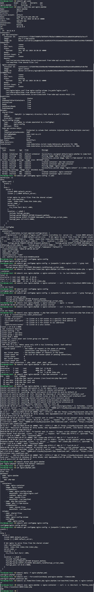

# Day 53: Resolve VolumeMounts Issue in Kubernetes


## Objective
Troubleshoot and fix a broken Nginx + PHP-FPM multi-container Pod. The setup was failing because of inconsistent volume mount paths between the web server and the PHP engine.


## 1. Architectural Theory: Shared Volumes in Sidecar Pods
In a standard PHP-FPM setup on Kubernetes, two containers must work in sync:
1.  **Nginx (The Frontend):** Receives the request and determines the file path.
2.  **PHP-FPM (The Backend):** Receives the path from Nginx and executes the code.

**The "Shared Volume" Requirement:** Because these are two separate containers, they do not share a filesystem by default. They must both mount the same **EmptyDir** volume at the **exact same path**. If Nginx thinks the files are in `/usr/share/nginx/html` but PHP-FPM expects them in `/var/www/html`, the handoff will fail with a "Primary script unknown" error.


## 2. Problem Identification (The Bug)
By describing the pod and inspecting the ConfigMap, we identified two critical mismatches:

*   **Pod Spec Error:** The `nginx-container` was mounting the `shared-files` volume at `/usr/share/nginx/html`, while the `php-fpm-container` was mounting it at `/var/www/html`.
*   **ConfigMap Error:** The `nginx.conf` was set to `root /var/www/html;`. While this matched the PHP side, Nginx could not see the files because its mount point was different.


## 3. Resolution Steps

### Step A: Updated the Pod Manifest
We deleted the existing Pod and created a corrected manifest (`nginx-phpfpm.yaml`) to unify the mount paths.

```yaml
spec:
  containers:
    - name: nginx-container
      image: nginx:latest
      volumeMounts:
        - name: shared-files
          mountPath: /var/www/html # Changed from /usr/share/nginx/html
    - name: php-fpm-container
      image: php:7.2-fpm-alpine
      volumeMounts:
        - name: shared-files
          mountPath: /var/www/html
```

### Step B: Updated the ConfigMap
We edited the `nginx-config` ConfigMap to ensure the `fastcgi_param` pointed to the correct directory.

```nginx
# Inside nginx.conf
root /var/www/html;

location ~ \.php$ {
    fastcgi_param SCRIPT_FILENAME $document_root$fastcgi_script_name;
    fastcgi_pass 127.0.0.1:9000;
}
```

### Step C: Deployed and Injected Application Code
We applied the fixes and moved the application code from the jump host into the running pod.

```bash
kubectl apply -f nginx-phpfpm.yaml

# Copy the index file into the shared volume via the nginx container
kubectl cp /home/thor/index.php nginx-phpfpm:/var/www/html/index.php -c nginx-container
```


## 4. Final Verification
We tested the endpoint using `curl` inside the container to verify the 200 OK response.

```bash
kubectl exec nginx-phpfpm -c nginx-container -- curl -s -I http://localhost:8099/index.php
```

### Result
The server successfully responded with **HTTP 200 OK**. By unifying the mount points to `/var/www/html` across both containers and the Nginx configuration, the communication link between the web server and the PHP processor was restored.


## Screenshot
