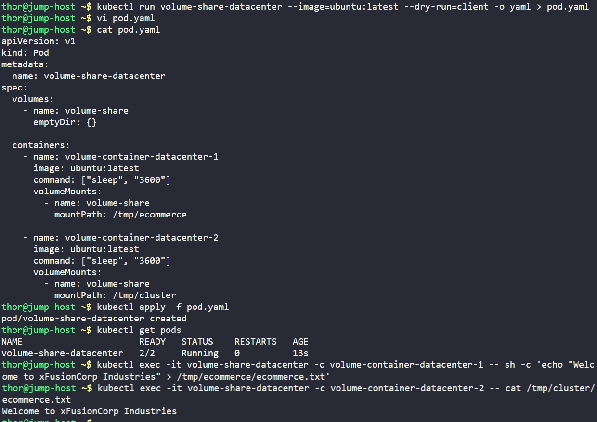

# Day 54: Kubernetes Shared Volumes


## Objective
The objective was to deploy a multi-container Pod where two containers share data through a common storage volume. This setup demonstrates how separate processes within the same Pod can interact using the local filesystem.


## 1. Shared Volumes (`emptyDir`)
In Kubernetes, an **`emptyDir`** volume is created when a Pod is assigned to a Node and exists as long as that Pod is running on that node. 
* **Shared Storage:** All containers in the Pod can read and write the same files in the `emptyDir` volume, though each container can mount the volume at the same or different paths.
* **Lifecycle:** It is a temporary storage solution. If a container crashes, the data remains; however, if the Pod is deleted from the node, the data in the `emptyDir` is deleted permanently.


## 2. Developed the Pod Manifest
Created a declarative YAML manifest defining the shared volume and the two Ubuntu-based containers.

```yaml
apiVersion: v1
kind: Pod
metadata:
  name: volume-share-datacenter
spec:
  volumes:
    - name: volume-share
      emptyDir: {}  # Defined the shared volume

  containers:
    - name: volume-container-datacenter-1
      image: ubuntu:latest
      command: ["sleep", "3600"]
      volumeMounts:
        - name: volume-share
          mountPath: /tmp/ecommerce # Mount path for container 1

    - name: volume-container-datacenter-2
      image: ubuntu:latest
      command: ["sleep", "3600"]
      volumeMounts:
        - name: volume-share
          mountPath: /tmp/cluster   # Different mount path for container 2
```


## 3. Deployed and Synchronized Data
Applied the manifest and then performed an inter-container data test.

```bash
# Create the Pod
kubectl apply -f pod.yaml

# Write data from Container 1
kubectl exec volume-share-datacenter -c volume-container-datacenter-1 -- \
  sh -c 'echo "Welcome to xFusionCorp Industries" > /tmp/ecommerce/ecommerce.txt'
```


## 4. Verification
Accessed the second container to verify that the file written by the first container was visible at the second container's specific mount point.

```bash
# Read data from Container 2
kubectl exec volume-share-datacenter -c volume-container-datacenter-2 -- \
  cat /tmp/cluster/ecommerce.txt
```

### Result
**Output:** `Welcome to xFusionCorp Industries`

The verification was successful. Although the containers used different internal paths (`/tmp/ecommerce` vs `/tmp/cluster`), the underlying **`emptyDir`** volume allowed seamless data sharing between them.


## Screenshot
