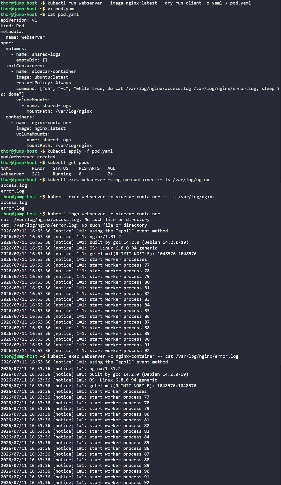

# Day 55: Kubernetes Sidecar Containers

## Objective
The objective was about getting visibility into Nginx's logs without adding real persistent storage.

Nginx writes its access and error logs inside its own container, and normally those logs vanish the moment the container restarts. To fix that, we added a second container to the same pod that continuously reads and prints those logs — this is the "sidecar" pattern, where a helper container supports the main app container by sharing its data through a common temporary volume. The twist for this task specifically was that Kubernetes has a newer way to build sidecars (v1.28+) that makes them start together with the main container instead of blocking it, done by marking the sidecar as an `initContainer` with `restartPolicy: Always`, and that's the version this task required us to use.

We used cat to print the logs to stdout but for the setup, the sidecar would instead ship these logs to a centralized logging service like Fluentd, Loki, or ELK so logs from every pod are collected in one place, easy to search, and don't disappear when a pod restarts.


## 1. The Native Sidecar Trick

In standard Kubernetes, `initContainers` must run to completion and exit before the main `containers` can start. However, this task uses an infinite loop (`while true`) in the init container. 

### Why `restartPolicy: Always` is Mandatory here:
1. **The "Wait" Problem:** Without this flag, Kubernetes would wait forever for the `sidecar init container` to finish before starting the main nginx container. Since the command is an infinite loop, the Nginx container would never start.
2. **The "Sidecar" Signal:** Setting `restartPolicy: Always` inside an `initContainer` block tells Kubernetes: *"This is an init container and sidecar. Start it, but don't wait for it to exit before starting the main app containers."*
    * **Command (`while true`):** Keeps the process busy inside the container.
    * **`restartPolicy: Always`:** Changes Kubernetes' scheduling behavior to allow parallel execution and ensures the container is restarted if it ever crashes.

We do this when we want the sidecar container to statrt before the main container, if for example the main container depends on the sidecar being ready first.

## 2. Created the Pod Manifest
Created the `pod.yaml` ensuring the sidecar was placed in the `initContainers` section as requested.

```yaml
apiVersion: v1
kind: Pod
metadata:
  name: webserver
spec:
  volumes:
    - name: shared-logs
      emptyDir: {}
  initContainers:
    - name: sidecar-container
      image: ubuntu:latest
      restartPolicy: Always  # Mandatory flag for init-sidecars
      command: ["sh", "-c", "while true; do cat /var/log/nginx/access.log /var/log/nginx/error.log; sleep 30; done"]
      volumeMounts:
        - name: shared-logs
          mountPath: /var/log/nginx
  containers:
    - name: nginx-container
      image: nginx:latest
      volumeMounts:
        - name: shared-logs
          mountPath: /var/log/nginx
```


## 3. Deployment and Execution
Applied the manifest and verified that the Pod reached the `Ready` state despite the infinite loop in the init section.

```bash
kubectl apply -f pod.yaml
kubectl get pods
```

**Observation:** The status `2/2 Running` confirms that Kubernetes successfully started the main Nginx container alongside the init-sidecar.


## 4. Verification
To confirm the Sidecar was functioning correctly, we compared the logs being "shipped" (printed) by the sidecar against the source log file inside the Nginx container.

**Step A: Check logs printed by the Sidecar**
```bash
# Check sidecar logs
kubectl logs webserver -c sidecar-container
```

**Step B: Check the source error log in the Nginx container**
```bash
# Check source nginx logs
kubectl exec webserver -c nginx-container -- cat /var/log/nginx/error.log
```

### Result
The sidecar successfully printed the Nginx logs to the console:
```text
2026/07/11 16:53:36 [notice] 1#1: nginx/1.31.2
2026/07/11 16:53:36 [notice] 1#1: start worker processes
...
```

By utilizing `initContainers` with `restartPolicy: Always`, we implemented a native sidecar that starts before the application but continues to run alongside it throughout the Pod's lifecycle.


## Screenshot
