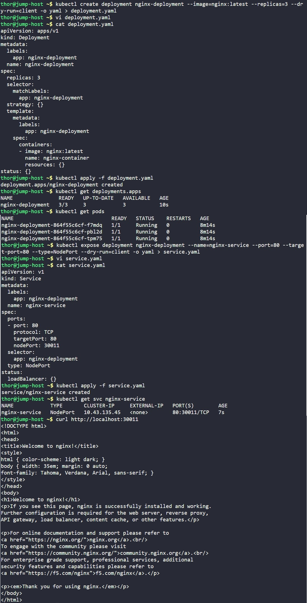

# Day 56: Deploy Nginx Web Server on Kubernetes Cluster

## Objective
The objective was to deploy a highly available and scalable static web server using Nginx on a Kubernetes cluster. To ensure external accessibility, we configured a NodePort service to expose the deployment on a specific port across all cluster nodes.


## 1. Created the Nginx Deployment
Used a declarative YAML manifest to define the deployment state, ensuring we met the requirement for 3 replicas to provide high availability.

```bash
# Generate initial template
kubectl create deployment nginx-deployment --image=nginx:latest --replicas=3 --dry-run=client -o yaml > deployment.yaml
```

**Manifest Highlights (`deployment.yaml`):**
- **Name:** `nginx-deployment`
- **Replicas:** `3`
- **Container Name:** `nginx-container`
- **Image:** `nginx:latest`

Applied the manifest and verified the rollout:
```bash
kubectl apply -f deployment.yaml
kubectl get deployments
```
**Observation:** The status `3/3 READY` confirmed that all replicas were successfully initialized across the cluster.


## 2. Configured the NodePort Service
To make the Nginx application reachable from outside the cluster, I created a **NodePort** service. This type of service opens a specific port on every node in the cluster, forwarding traffic to the underlying pods.

```bash
# Generate service template
kubectl expose deployment nginx-deployment --name=nginx-service --port=80 --target-port=80 --type=NodePort --dry-run=client -o yaml > service.yaml
```

Then edited `service.yaml` to specify the requested static port:
```yaml
spec:
  type: NodePort
  ports:
    - port: 80
      targetPort: 80
      nodePort: 30011 # Custom port requested by developers
```

```bash
kubectl apply -f service.yaml
```


## 3. Final Verification
Verified the service mapping and performed a connectivity test using `curl` against the host's localhost address on the assigned NodePort.

```bash
# Check service details
kubectl get svc nginx-service

# Test connectivity
curl http://localhost:30011
```

### Result
The `curl` command returned the default Nginx welcome page:
```html
<h1>Welcome to nginx!</h1>
<p>If you see this page, nginx is successfully installed and working...</p>
```

The Nginx web server is now successfully deployed, scaled to 3 instances, and externally accessible via port **30011**.


## Screenshot
