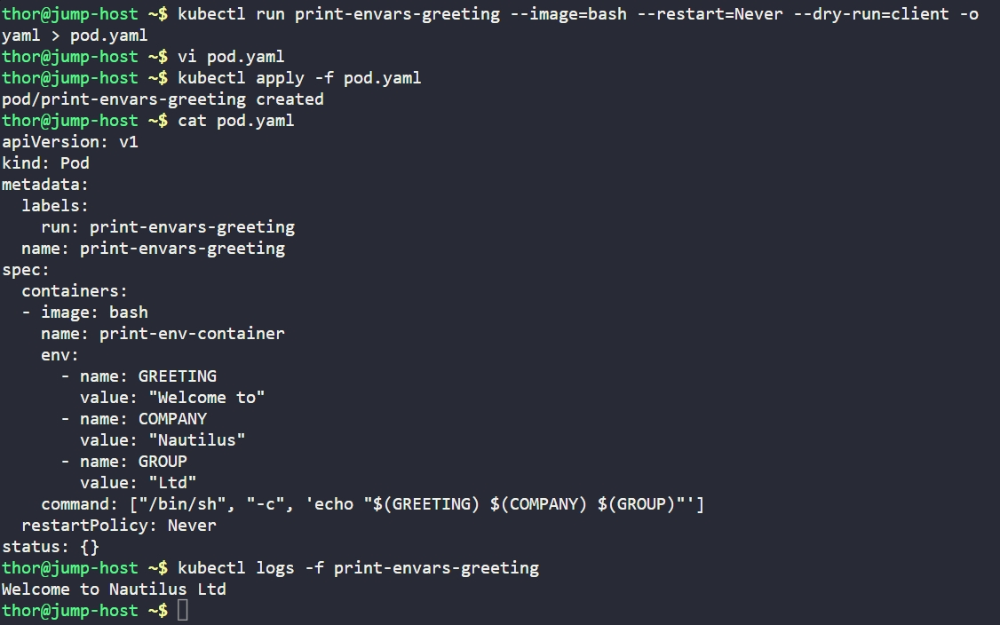

# Day 57: Print Environment Variables

## Objective
The objective was to configure a Kubernetes Pod to utilize **Environment Variables** within a container. This demonstrates how to pass configuration data dynamically to an application without hardcoding it into the container image.


Environment variables (`env`) in Kubernetes allow us to inject key-value pairs into a container's runtime environment. 
*   **Decoupling:** This allows us to use the same image for different environments (Dev, QA, Prod) simply by changing the variable values in the Pod manifest.
*   **Variable Substitution:** Kubernetes lets us use an env var's value inside command, by writing $(VAR_NAME). Before the container starts, Kubernetes swaps $(VAR_NAME) for the actual value.
*   **Restart Policy:** By setting `restartPolicy: Never`, we ensure that once the container finishes its command (echoing the message), Kubernetes does not attempt to restart it, which prevents a "CrashLoopBackOff" status for run-to-completion tasks.


## 1. Developed the Pod Manifest
Used the `kubectl run` command with a dry-run flag to generate the initial YAML and then edited it to include the specific requirements.

```bash
kubectl run print-envars-greeting --image=bash --restart=Never --dry-run=client -o yaml > pod.yaml
```

Then modified the yaml manifest by adding the environment variables and changing the container's name.

**Manifest Content (`pod.yaml`):**
```yaml
apiVersion: v1
kind: Pod
metadata:
  name: print-envars-greeting
spec:
  containers:
  - image: bash
    name: print-env-container
    env:
      - name: GREETING
        value: "Welcome to"
      - name: COMPANY
        value: "Nautilus"
      - name: GROUP
        value: "Ltd"
    command: ["/bin/sh", "-c", 'echo "$(GREETING) $(COMPANY) $(GROUP)"']
  restartPolicy: Never
```


## 2. Deployment and Verification
Applied the manifest and monitored the output logs to ensure the variables were correctly concatenated and printed.

```bash
# Create the Pod
kubectl apply -f pod.yaml

# Check the output logs
kubectl logs -f print-envars-greeting
```

### Result
**Output:** `Welcome to Nautilus Ltd`

The Pod successfully initialized the environment variables and utilized them within the shell command to produce the expected greeting.


## Screenshot
