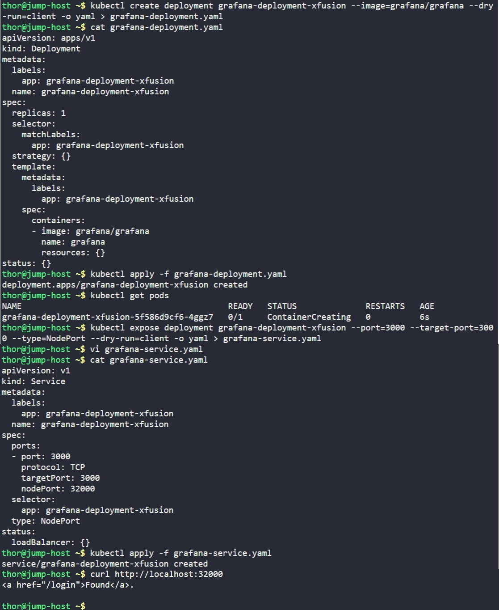

# Day 58: Deploy Grafana on Kubernetes Cluster


## Objective
Establish a Grafana instance on the Kubernetes cluster for future analytics and monitoring. The deployment requires external accessibility through a specific static NodePort.


## 1. Created Grafana Deployment
Created a declarative deployment manifest for Grafana. By default, Grafana listens on port **3000**.

```bash
# Generated and applied deployment manifest
kubectl create deployment grafana-deployment-xfusion --image=grafana/grafana --dry-run=client -o yaml > grafana-deployment.yaml
kubectl apply -f grafana-deployment.yaml
```

**Manifest Highlights:**
- **Name:** `grafana-deployment-xfusion`
- **Image:** `grafana/grafana` (Official image)
- **Replicas:** 1


## 2. Configured NodePort Service
To expose the Grafana UI outside the cluster, I created a **NodePort** service and manually mapped it to the requested port **32000**.

```bash
# Generated and edited service manifest
kubectl expose deployment grafana-deployment-xfusion --port=3000 --target-port=3000 --type=NodePort --dry-run=client -o yaml > grafana-service.yaml
```

**Customized Service Configuration (`grafana-service.yaml`):**
```yaml
spec:
  type: NodePort
  ports:
    - port: 3000
      targetPort: 3000
      nodePort: 32000 # Specific port requested by DevOps team
  selector:
    app: grafana-deployment-xfusion
```


## 3. Final Verification
Verified that the Pod was successfully created and the service was routing traffic correctly.

```bash
# Check Pod status
kubectl get pods

# Check Service details
kubectl get svc grafana-deployment-xfusion
```

### Result
The Grafana deployment reached a **Running** state. The application is now externally accessible via any cluster node's IP on port **32000**, serving the standard Grafana login page.


## Screenshot
