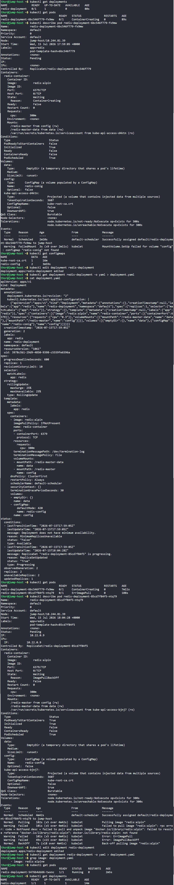

# Day 59: Troubleshoot Deployment issues in Kubernetes


## Objective
The goal was to restore the `redis-deployment` in the Kubernetes cluster. After an update by a team member, the deployment failed to reach a "Ready" state. The task required identifying the specific errors in the configuration and correcting them.


## 1. Root Cause Analysis

I used a systematic approach to identify two separate configuration errors preventing the Pods from running.

### Issue 1: Volume Mount Failure (Typo in ConfigMap Name)
Initially, the Pod stayed in the `ContainerCreating` status.
*   **Command:** `kubectl describe pod <pod-name>`
*   **Finding:** The events log showed: `MountVolume.SetUp failed for volume "config" : configmap "redis-conig" not found`.
*   **Verification:** `kubectl get configmaps` confirmed the actual name was `redis-config`.

### Issue 2: Image Pull Failure (Typo in Image Tag)
After fixing the ConfigMap name, the Pod transitioned to `ErrImagePull`.
*   **Command:** `kubectl describe pod <pod-name>`
*   **Finding:** The container was attempting to pull `redis:alpin`.
*   **Verification:** The official tag is `redis:alpine`. The missing "e" at the end of the tag caused the container registry to return a "Not Found" error.


## 2. Resolution Steps

I applied the fixes by editing the deployment manifest directly.

```bash
kubectl edit deployment redis-deployment
```

**Changes applied to the manifest:**
1.  **Corrected Volume Specification:**
    ```yaml
    volumes:
    - name: config
      configMap:
        name: redis-config  # Fixed from "redis-conig"
    ```
2.  **Corrected Container Image:**
    ```yaml
    spec:
      containers:
      - name: redis-container
        image: redis:alpine # Fixed from "redis:alpin"
    ```


## 3. Final Verification

After the edits were saved, Kubernetes automatically triggered new rollouts.

```bash
# Monitor the Pod transition
kubectl get pods

# Check Deployment status
kubectl get deployments
```

### Result
*   **Pod Status:** `redis-deployment-5476b4ddd6-twxnc` reached **1/1 Running**.
*   **Deployment Availability:** `1/1` replicas available.

The errors have been resolved. The deployment is now correctly pulling the valid `alpine` image and successfully mounting the `redis-config` ConfigMap.


## Screenshot
