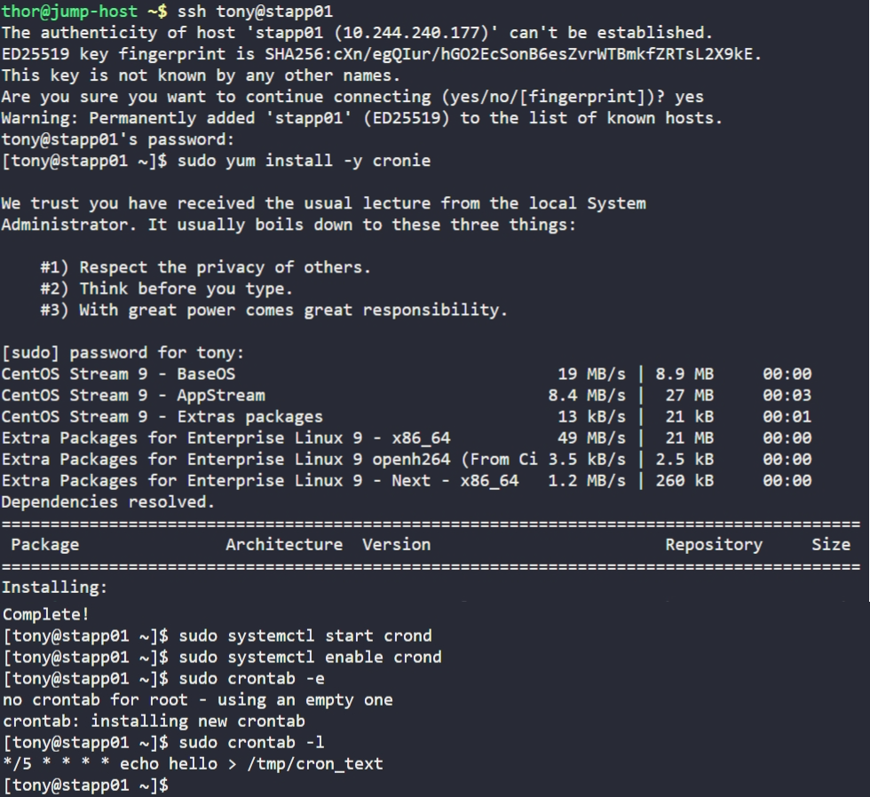

# Day 6: Create a Cron Job

## Objective

The team has prepared scripts to automate several day to day tasks and we want them to be deployed on all app servers but before that we want to test similar functionality with a sample cron job, so we need to:
1. Install `cronie` package on all app servers and start crond service.
2. Add a cron `*/5 * * * * echo hello > /tmp/cron_text` for root user: runs every 5 minutes as root and writes to /tmp/cron_text

## Steps (repeated on each server)

1. Install + start cron

```bash
sudo yum install -y cronie
sudo systemctl start crond
sudo systemctl enable crond
```

2. Add cron job (root)

```bash
sudo crontab -e
```

Add:
```bash
*/5 * * * * echo hello > /tmp/cron_text
```

3. Verify

```bash
sudo crontab -l
```

## Screenshot

