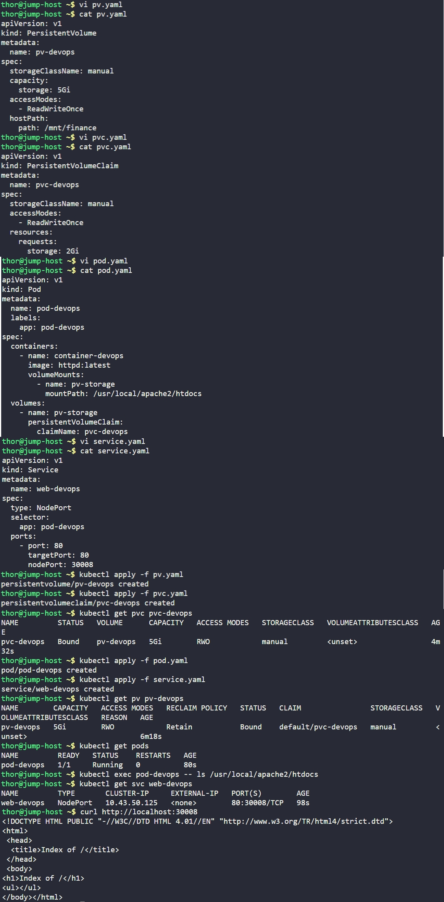

# Day 60: Persistent Volumes in Kubernetes

## Objective
The objective is to deploy a web application on the Kubernetes cluster utilizing persistent storage. This ensures that application data is stored on the host's physical hard drive, allowing it to survive Pod restarts or crashes.

## 1. PV and PVC

A PersistentVolume (PV) is just another volume type, same family as `emptyDir`, `hostPath`, or `configMap`. The difference is its lifetime: an `emptyDir` volume dies with its pod, but a PV doesn't. If we delete the pod, recreate it, even reschedule it, the PV and whatever's stored in it stay exactly as they were.

A pod never mounts a PV directly. Instead, we create a separate object called a PersistentVolumeClaim (PVC), which represents a request for storage rather than the storage itself. The PVC specifies what's needed (a capacity like `2Gi`) and an access mode (`ReadWriteOnce`) and Kubernetes searches for an existing PV that satisfies those requirements, then binds the two together. Once bound, the PVC effectively becomes the pod's handle on that storage.

The pod's `volumes:` section then references the PVC by name, not the PV directly:

```yaml
volumes:
  - name: my-storage
    persistentVolumeClaim:
      claimName: my-pvc
```

In a manually managed cluster like this one, both the PV and the PVC are created by hand, nothing is provisioned automatically. Kubernetes' only automated role is the matching step, binding a PVC to any existing PV whose capacity and access mode are sufficient. (In a cloud-managed cluster with dynamic provisioning configured, creating a PVC alone can trigger automatic creation of a matching PV)

## 2. Created the Persistent Volume (PV)
I created the `pv.yaml` manifest to define 5Gi of storage using the `hostPath` type, which maps to the existing `/mnt/finance` directory on the cluster node.

```yaml
# pv.yaml
apiVersion: v1
kind: PersistentVolume
metadata:
  name: pv-devops
spec:
  storageClassName: manual
  capacity:
    storage: 5Gi
  accessModes:
    - ReadWriteOnce
  hostPath:
    path: /mnt/finance
```

## 3. Created the Persistent Volume Claim (PVC)
I created the `pvc.yaml` manifest to request 2Gi of space. I set the `storageClassName` to **manual** to ensure Kubernetes matches this claim specifically to the PV created in the previous step.

```yaml
# pvc.yaml
apiVersion: v1
kind: PersistentVolumeClaim
metadata:
  name: pvc-devops
spec:
  storageClassName: manual
  accessModes:
    - ReadWriteOnce
  resources:
    requests:
      storage: 2Gi
```

## 4. Deployed the Application Pod
I created the `pod.yaml` manifest using the `httpd:latest` image. I configured the pod's volume section to use the `pvc-devops` claim and mounted it at the Apache document root folder.

```yaml
# pod.yaml
apiVersion: v1
kind: Pod
metadata:
  name: pod-devops
  labels:
    app: pod-devops
spec:
  containers:
    - name: container-devops
      image: httpd:latest
      volumeMounts:
        - name: pv-storage
          mountPath: /usr/local/apache2/htdocs
  volumes:
    - name: pv-storage
      persistentVolumeClaim:
        claimName: pvc-devops
```

## 5. Configured NodePort Service
I created the `service.yaml` manifest to expose the application to the network. I specified **nodePort 30008** so the website can be reached from the jump-host.

```yaml
# service.yaml
apiVersion: v1
kind: Service
metadata:
  name: web-devops
spec:
  type: NodePort
  selector:
    app: pod-devops
  ports:
    - port: 80
      targetPort: 80
      nodePort: 30008
```

## 6. Verification
I applied all manifests to the cluster and checked the status of the storage components to ensure they were correctly linked.

```bash
kubectl apply -f pv.yaml
kubectl apply -f pvc.yaml
kubectl apply -f pod.yaml
kubectl apply -f service.yaml

# Checking if PVC is Bound to the PV
kubectl get pvc pvc-devops
kubectl get pv pv-devops

# Checking if the Pod is running and serving content
curl http://localhost:30008
```

### Result
Tthe PVC successfully reached the **Bound** status. The Apache pod is now up and running, successfully serving data from the persistent host path.

## Screenshot
