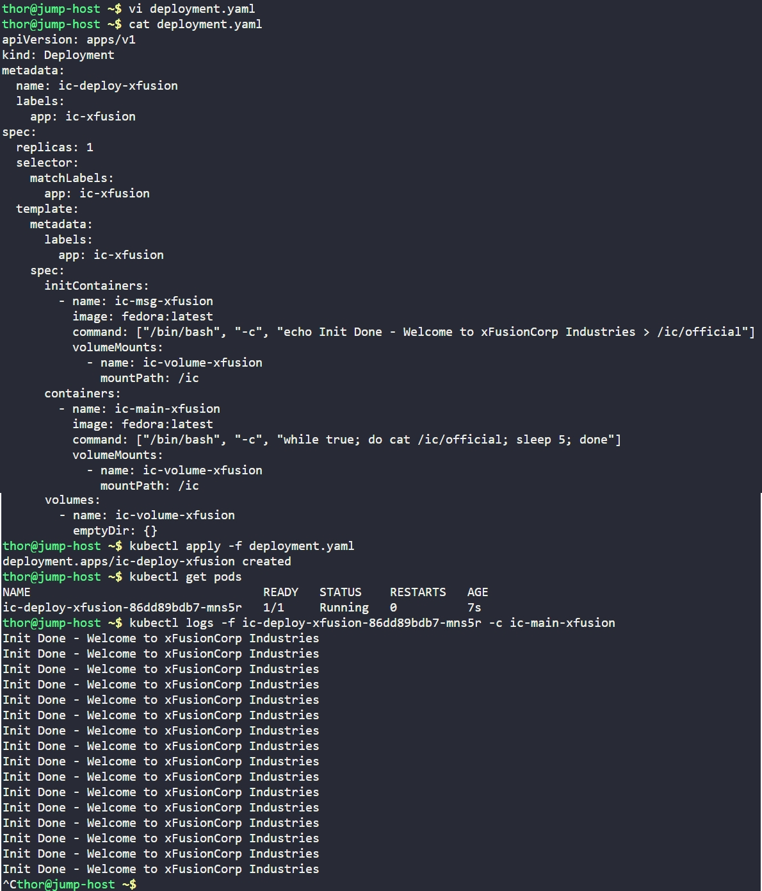

# Day 61: Init Containers in Kubernetes

## Objective
The objective is to deploy a Kubernetes application that requires pre-configuration before the main application starts. I implemented this using an **Init Container** to prepare a message file in a shared volume, ensuring the main container has the necessary data available at startup.

## 1. Init Containers

In Kubernetes, Pods can have multiple containers, but **Init Containers** are special "setup" containers that run to completion before any regular containers start.

**Sequential Execution**
Init containers always run one after another in a specific order. If a Pod has three init containers, the first must finish successfully before the second begins. The main application containers only start if **all** init containers exit with a success code (0).

**Separation of Concerns**
Init containers are perfect for tasks that shouldn't be baked into the main application image, such as:
*   Waiting for a database to be ready.
*   Downloading configuration files from a secure vault.
*   Setting file permissions on a shared volume.
*   Generating dynamic startup messages (as done in this task).

**Shared Volumes**
Because init containers and main containers share the same Pod environment, they can communicate through shared volumes like `emptyDir`. In this task, the init container acts as a "writer" and the main container acts as a "reader."

## 2. Developed the Deployment Manifest
I created the `deployment.yaml` file to define the initialization logic and the shared storage requirements.

```yaml
apiVersion: apps/v1
kind: Deployment
metadata:
  name: ic-deploy-xfusion
  labels:
    app: ic-xfusion
spec:
  replicas: 1
  selector:
    matchLabels:
      app: ic-xfusion
  template:
    metadata:
      labels:
        app: ic-xfusion
    spec:
      initContainers:
        - name: ic-msg-xfusion
          image: fedora:latest
          command: ["/bin/bash", "-c", "echo Init Done - Welcome to xFusionCorp Industries > /ic/official"]
          volumeMounts:
            - name: ic-volume-xfusion
              mountPath: /ic
      containers:
        - name: ic-main-xfusion
          image: fedora:latest
          command: ["/bin/bash", "-c", "while true; do cat /ic/official; sleep 5; done"]
          volumeMounts:
            - name: ic-volume-xfusion
              mountPath: /ic
      volumes:
        - name: ic-volume-xfusion
          emptyDir: {}
```

## 3. Deployment and Execution
I applied the manifest to the cluster and monitored the Pod lifecycle.

```bash
kubectl apply -f deployment.yaml

# Monitor Pod status
kubectl get pods
```

## 4. Verification
I verified that the main container successfully inherited the data from the init container by checking its logs.

```bash
# Check logs of the main container
kubectl logs -f ic-deploy-xfusion-86dd89bdb7-mns5r -c ic-main-xfusion
```

### Result
The logs showed a continuous stream of the message generated by the init container:
```text
Init Done - Welcome to xFusionCorp Industries
Init Done - Welcome to xFusionCorp Industries
```

This confirms that the init container successfully executed its task and the shared `emptyDir` volume correctly persisted the data for the main application container.

## Screenshot
