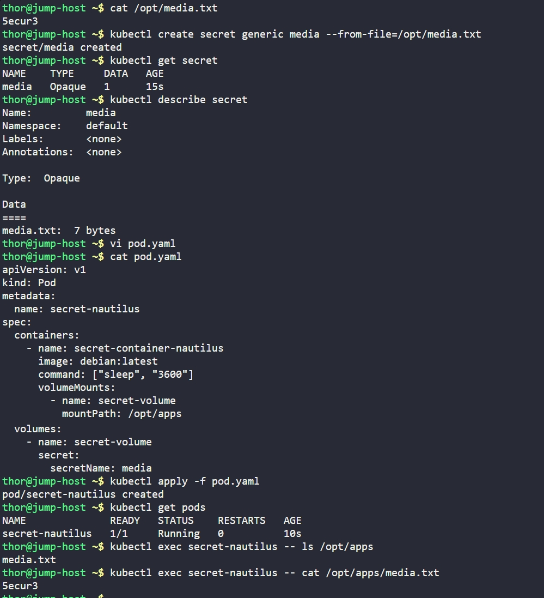

# Day 62: Manage Secrets in Kubernetes

## Objective
The objective is to securely store sensitive data, such as license numbers or passwords, within a Kubernetes cluster using **Secrets**. I created a secret from a physical file and then configured a Pod to "consume" that secret by mounting it as a volume, making the sensitive data available to the application as a file.


## 1. Created the Kubernetes Secret
I created a generic secret named `media` using the content of the existing `/opt/media.txt` file.

```bash
# Check the content of the source file
cat /opt/media.txt

# Create the secret from the file
kubectl create secret generic media --from-file=/opt/media.txt
```

## 2. Developed the Pod Manifest
I created the `pod.yaml` manifest to deploy a Debian container. I configured the Pod to use the `media` secret by defining a volume and mounting it at the requested path.

```yaml
# pod.yaml
apiVersion: v1
kind: Pod
metadata:
  name: secret-nautilus
spec:
  containers:
    - name: secret-container-nautilus
      image: debian:latest
      command: ["sleep", "3600"]
      volumeMounts:
        - name: secret-volume
          mountPath: /opt/apps
  volumes:
    - name: secret-volume
      secret:
        secretName: media
```

## 3. Deployment and Verification
I applied the manifest to the cluster and verified that the secret data was correctly injected into the container's filesystem.

```bash
kubectl apply -f pod.yaml

# Check if the pod is running
kubectl get pods

# Verify the secret file exists in the container
kubectl exec secret-nautilus -- ls /opt/apps

# Verify the content of the secret file
kubectl exec secret-nautilus -- cat /opt/apps/media.txt
```

### Result
The container successfully mounted the secret. The file `/opt/apps/media.txt` was present and contained the correct license string: `5ecur3`. The sensitive information is now safely managed by Kubernetes and accessible only to the authorized container.

## Screenshot
