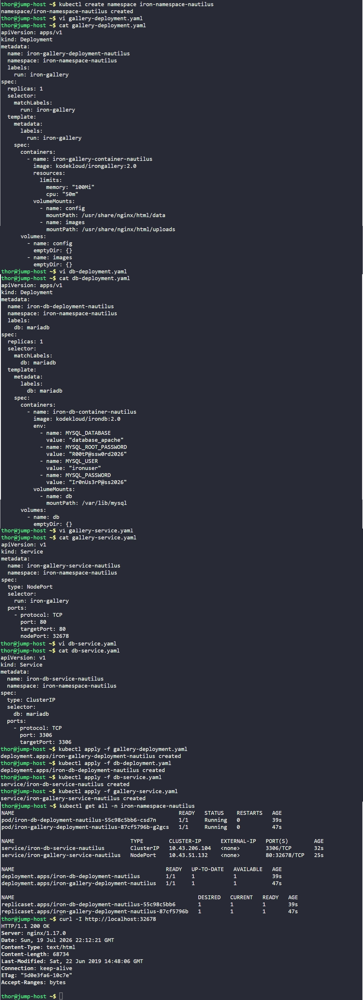

# Day 63: Deploy Iron Gallery App on Kubernetes


## Objective
The objective is to deploy a two-tier application (a web gallery and a database) into a dedicated, isolated environment on the Kubernetes cluster. I configured a custom namespace, two deployments with resource limits and temporary storage, and the necessary services to allow internal and external communication.


**Namespaces**
A Namespace acts like a dedicated sub-folder within the cluster. It keeps all "Iron Gallery" resources isolated so they do not interfere with other applications.

**Service Types**
The setup uses two different ways to handle traffic:
*   **NodePort (Public):** Opens a specific port (32678) on all cluster nodes so the web gallery is reachable from the outside.
*   **ClusterIP (Private):** Creates an internal-only connection for the database. This ensures the database is hidden from the internet and only accessible by the web gallery.

**Resource Limits**
To keep the cluster stable, the containers have strict "ceilings" on CPU and Memory. If a container tries to use too much power, Kubernetes will throttle or restart it to protect other apps.

**emptyDir Volumes**
These are temporary storage areas. They allow the gallery and database to write files while running, but the data is automatically deleted if the Pod is removed, keeping the system clean.


## 1. Created the Namespace
I started by creating the dedicated environment for all resources.

```bash
kubectl create namespace iron-namespace-nautilus
```

## 2. Deployed the Iron Gallery (Front-end)
I created `gallery-deployment.yaml` with the specific resource limits and shared volume paths required for the web server to function.

```yaml
# gallery-deployment.yaml
apiVersion: apps/v1
kind: Deployment
metadata:
  name: iron-gallery-deployment-nautilus
  namespace: iron-namespace-nautilus
  labels:
    run: iron-gallery
spec:
  replicas: 1
  selector:
    matchLabels:
      run: iron-gallery
  template:
    metadata:
      labels:
        run: iron-gallery
    spec:
      containers:
        - name: iron-gallery-container-nautilus
          image: kodekloud/irongallery:2.0
          resources:
            limits:
              memory: "100Mi"
              cpu: "50m"
          volumeMounts:
            - name: config
              mountPath: /usr/share/nginx/html/data
            - name: images
              mountPath: /usr/share/nginx/html/uploads
      volumes:
        - name: config
          emptyDir: {}
        - name: images
          emptyDir: {}
```

## 3. Deployed the Iron DB (Back-end)
I created `db-deployment.yaml`. I injected the database credentials via environment variables so the MariaDB engine could initialize the requested database automatically.

```yaml
# db-deployment.yaml
apiVersion: apps/v1
kind: Deployment
metadata:
  name: iron-db-deployment-nautilus
  namespace: iron-namespace-nautilus
  labels:
    db: mariadb
spec:
  replicas: 1
  selector:
    matchLabels:
      db: mariadb
  template:
    metadata:
      labels:
        db: mariadb
    spec:
      containers:
        - name: iron-db-container-nautilus
          image: kodekloud/irondb:2.0
          env:
            - name: MYSQL_DATABASE
              value: "database_apache"
            - name: MYSQL_ROOT_PASSWORD
              value: "R00tP@ssw0rd2026"
            - name: MYSQL_USER
              value: "ironuser"
            - name: MYSQL_PASSWORD
              value: "Ir0nUs3rP@ss2026"
          volumeMounts:
            - name: db
              mountPath: /var/lib/mysql
      volumes:
        - name: db
          emptyDir: {}
```

## 4. Configured the Networking (Services)
I created two service manifests to handle traffic routing.

**Gallery Service (External):**
```yaml
# gallery-service.yaml
apiVersion: v1
kind: Service
metadata:
  name: iron-gallery-service-nautilus
  namespace: iron-namespace-nautilus
spec:
  type: NodePort
  selector:
    run: iron-gallery
  ports:
    - port: 80
      targetPort: 80
      nodePort: 32678
```

**Database Service (Internal):**
```yaml
# db-service.yaml
apiVersion: v1
kind: Service
metadata:
  name: iron-db-service-nautilus
  namespace: iron-namespace-nautilus
spec:
  type: ClusterIP
  selector:
    db: mariadb
  ports:
    - port: 3306
      targetPort: 3306
```

## 5. Deployment and Verification
I applied all the manifests and checked the status within the custom namespace.

```bash
kubectl apply -f gallery-deployment.yaml
kubectl apply -f db-deployment.yaml
kubectl apply -f gallery-service.yaml
kubectl apply -f db-service.yaml

# Verify all resources are running
kubectl get all -n iron-namespace-nautilus

# Test the web front-end
curl -I http://localhost:32678
```

### Result
I verified that all Pods reached the **Running** status. The `curl` command returned an **HTTP/1.1 200 OK**, confirming the Nginx-based gallery is active and accessible via the NodePort.

## Screenshot
